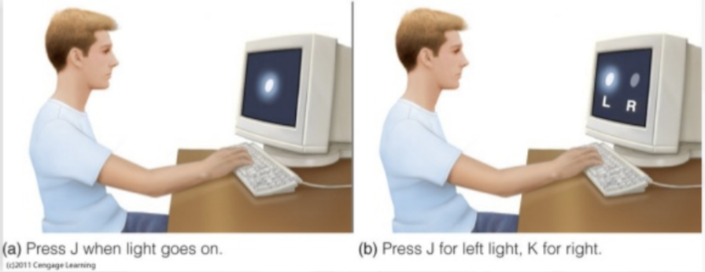

# Cognition and neuroscience

## Vincenzo Romei

This guy studies the relation between **brain activity** and **behaviour**. 

The question we'd like to answer is: **how does AI relate to cognitive science**?

The first hours (module 1, until 19th April) will be taught by Vincenzo Romei, while the other 32 will be by Di Pellegrino.

What a neuroscientist wants is creating a link between the body, and the functions that it performs.

The course material is composed of **scientific articles** and the **slides**.

### Exam

There will be three open questions (2 for module one, 1 for module 2).

It should be written, but since we're in the middle of a pandemic, it may become oral.

# Cognitive neuroscience

### The who

We started talking about this discipline around 1976 by psychologists (Gazzaniga/Miller). Gazzaniga was one of those people that really made a point about the relationship, studying **split brain patients** (patients in which the left and right brain are artificially separated, so there's no interaction between the two parts). This treatment actually stopped the spread of epilectic seizures, but apparently the person started to be quite normal, until they noticed that the person started to behave as **two different people**!

### The what

What do we mean by **cognitive neuroscience**? It's an integration of multiple disciplines, mixing psychology, neuroscience, cognition, social cognition, emotional processing, computer models...

We have **neuroscience** on one hand (known and discussed for many years, *wet neuroscience*) and **cognitive science** on the other. Putting these two (science of the neuron vs science of cognition) led to this science.

We are basically studying the relation between the system (body) and its functions (the behaviour).

So, *how did we get there?* Or *how does the brain create the mind?* This is known as the **mind-body problem**. Philosophers have always been interested in this question.

The first link of the mind to the brain was by Galenus (129-210 AC). He still thought that personality and emotions were generated by organs other than the brain. The crucial point, though, was that the mind and body were connected.

*Vesalius* (1514-1564), believed that the brain and the nervous system were the centre of mind and emotion. 

*René Descartes* (Cartesio!) was best known in western philosophy, mading a clear distinction between the phisycal and the mental: the *res extensa* (physical) and the *res cogita* (inconsistent thinking materia).

He was wrong about the *pineal gland*, but he wasn't that wrong in thinking that conscious experience was located in the fusiform region of the brain. Finally, he made a distinction between *bottom-up* and *top-down* processes.

*Leibniz* proposed that mind and body are separated, but shall be built to interact in **harmony**.

*Franz Joseph Gall* attempted to localise the brain in *the powers of the mind*, trying to understand why different people had different behaviours. One of the approaches taken to understand this was **phrenology**, i.e. localization of mental functions. The idea was great, the way of doing this research was kinda questionable: he looked for **shapes** in the head, like bumps, etc...

Phrenology is nowadays seen as a *pseudo-science*, but his studies helped establish psychology as a science!

A great question might be asking what qualities make the neural bases of a function amenable to experimental study? 

Finally, *Flourens* disproved phrenological claims. 

So, when do we end up finding the first demonstration of localization of function? *John Jackson* (1835-1911) started to try and localise the areas of the brain which control different functions, like muscles.

## Important guys in neuroscience 

### Gustav Fechner

### Frans Donders

First theorized reaction times, representing the time that the mental process requires. He actually distinguished between the simple reaction time (press a button when you hear the beep), vs. choice reaction time (left or right?).

The subtraction between these two later became the standard procedure in functional brain imaging. 

 

### William James

[Cool article here](https://markmanson.net/the-prime-belief). The father of modern psychology. Understood that physiology was needed to understand psychology, and pointed out than mental processes can be altered by injuries, drugs, etc...

### Hermann von Helmholtz

Started studying psychology in parallel with the nervous system. He developed the *myograph*, measuring the speed of travel of nerve impulses, discovering the concept of *velocity of thought*.

Then, a student of von Helmholtz, **du Bois-Reymond** demonstrated the electrical basis of nerve impulse. Around the same period, they started identifying discrete brain regions, period motor and sensory regions...

## Birth of cognitive science

George A Miller presented the *magical number seven, plus or minus two*, a paper referring to the capacity we have at any time, a certain quantity of information. We have limited capacity to maintain information, and we have to deal with it (it's like a momentary storage).

It argues that the number of objects an average human can hold in working memory is 7 pm 2, and it is frequently defined as the *Miller Law*.

