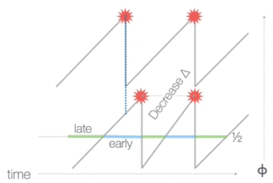

# 4. Agent-Based Models

Respect to equation-based mathematical models like the logistic map, agent-based models allow us to consider richest environments with greater fidelity. they are defined by:
 - **agents**, also called individuals;
 - **behaviors**: rules that guide agents;
 - **outcomes**: results of the behaviors.

Behaviors of individual agents may be:
 - simple, _dumb_, without goals or purpose;
 - _optimal_, based on rational choices (Game Theory);

Furthermore, interacting with the environment and possibly changing it;

## Langton's ants
It's a model made by a 2-Dimensional grid, where each square can be _black_ or _white_, which can be thought as the presence or the absence of _pheromones_. Agents are **ants** which have a direction and can turn right or left, move one square in the current direction or flip color of square they are on.  
Rules are:
 - if current square is white, then turn 90° right, flip the color of the square and move forward one unit;
 - if current square is black, the turn 90° left, flip the color of the square and move forward one unit.

This is not a linear system, so we cannot predict the behavior of 2 ants by looking at the behaviors of single ants and summing them.

## Foraging ants
Unlike Langton's ants, real ant pheromone trails _diffuse_ and _evaporate_ and it encodes the colony's collective information about the presence of food.

## Termites

The model is made by wood _chips_ distributed over a 2-Dimensional space. Termites (agents) can move, pick up or drop wood chips.  
Rules:
 - Wander randomly;
 - if bump into a wood chip and the termite is _free_, pick the chip up, and continue to wander randomly;
  - if bump into a wood chip and thermite already has another chip, then find an empty space and leave the carried chip, then continue to wander randomly.

What happens is that termites accumulate all the chips one close to the other in groups that become fewer and fewer, until reaching the situation where all the chips are together in a single group.

It's interesting to see that the macro behavior of a single termite is the same of multiple termites, it's only slower, because multiple termites can work in parallel.

## Sorting and peer effects

Sorting (homophily) is when individuals seek similar individuals. Another common behavior in real agent-based models is the peer effects, what happens when individuals adopt the behavior of their peers. The peer effect can results in a macro outcome called **flocking**, which is what happens to flying birds.

## Gossip-style interaction

In this model, effective for structuring decentralized solutions to problems in large networks, interactions between agents are limited to small number of _peers_ that know each other. The system is **fully symmetric** i.e. all peers act identically. The gossip can be:
 - _Reactive_ or _proactive_
 - _Push_, _pull_ or, _push pull_

The set of peers that a node knows is called is _view_ and defines an _overlay_ network.

### Proactive gossip framework

```
// active thread
do forever
  wait(T time units)
  q = SelectPeer()
  send S to q
  receive Sq from q
  S = Update(S,Sq)

// passive thread
do forever
  (Sp,p) = receive * from *
  send S to p
  S = Update(S,Sp)
```

To instantiate the framework, need to define
 - What constitutes the local state S
 - How peers are selected through method `SelectPeer()`
 - The style of interaction
   - push
   - pull
   - push-pull
 - How local state is updated through method `Update()`

## Heartbeat synchronization

Nature displays astonishing examples of synchrony among independent agents, like heart pacemaker cells or audience clapping at a concert.
This self-synchronization can be explained through _coupled oscillators_: each agent is an independent _oscillator_, like a pendulum. Oscillators are _coupled_ through the environments and they influence each other causing small local adjustments that result in global synchrony to emerge in a decentralized manner.

### Fireflies

Certain species of  fireflies, are known to synchronize their flashes despite each firefly has a small number of "neighbours" and communication is not istantaneous.

It can be modeled with the gossip framework, where the style of interaction is push, the local state S is  the period &Delta; of the local oscillator &Phi;. The method `Update()` resets the local oscillator based on the phase of the arriving flash as follows:
 - if the flash arrives _too early_ (&Phi; > 1/2), then _speed up_ (decrease period &Delta;);
 - if the flash arrives _too late_, then _slow down_ (increase period &Delta;)



Experimentaly, we can observe that the model is able to achieve heartbeat synchronization with a network of 210 nodes, a view size of 10, initial periods selected randomly and uniformly in the interval [0.85 - 1.15] and a message latency uniformly and randomly distributed in the interval [1 - 200] ms.

## Formation creation

We have agents able to move in physical space in any direction, each agent has a unique ID and can determine the relative position of other agents. Agents are interconnected through a sparse network that can be used to provide random samples from the entire population. We eant to devise a protocol such
that mobile agents self organize intro pre-specified global formations in a totally decentralized manner.

Also these problem can be modelled with the gossip framework, but this time the interaction style has going to be pull. The local state S is the current physical position and the motion vector. The method `Update()` compute the motion vector based on positions of most and least preferred neighbor
