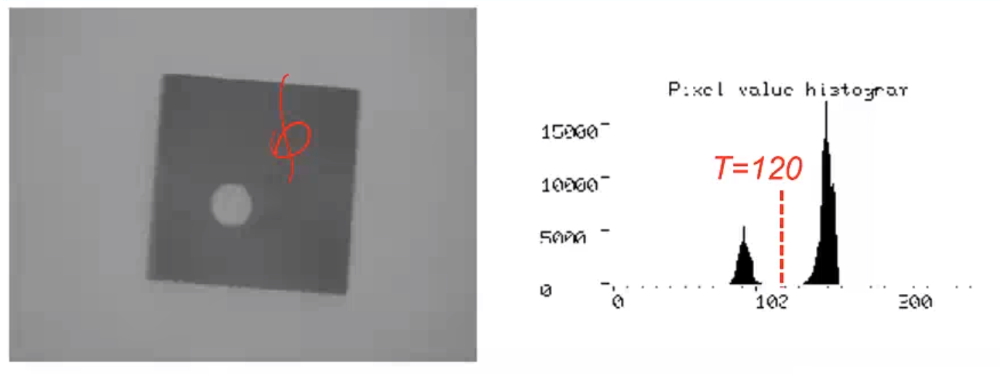

# Image segmentation

Denoted as , a vector-valued function encoding a set of image properties, teh goal of segmentation is to partition the image into disjoint homogeneous regions according to .

Typically, a good segmentation should preserve spatial proximity (i.e. two nearby pixels must belong to the same region unless they exhibit significantly different  values). In maany CV tasks, segmentation brings in key semantic knowledge in th scene. 

In many cases, we work with *inherently binary images*, meaning that clearly, in the given image, there's two regions, one being dark and one being clear. 

The first step is to just perform this **binarization**.

Inherently binary images exhibit a clearly bimodal gray-level histogram, with two well-separated peals corresponding to foreground and background pixels. Therefore, binarization can be achieved straightforwardly by means of a thresholding operator deploying a suitably chosen threshold:

How do we pick the threshold? We simply can look at the histogram.

