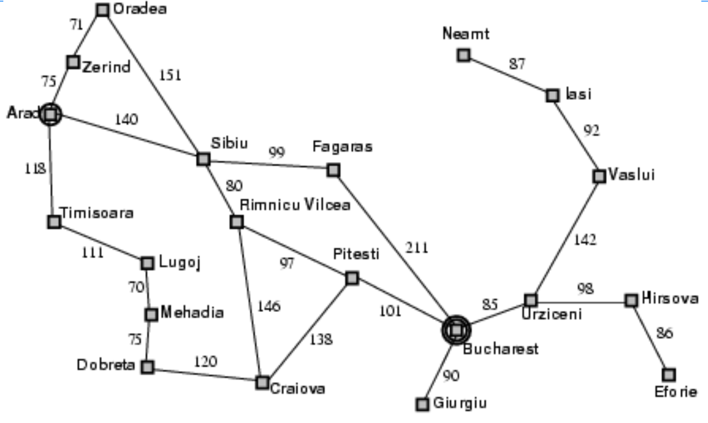
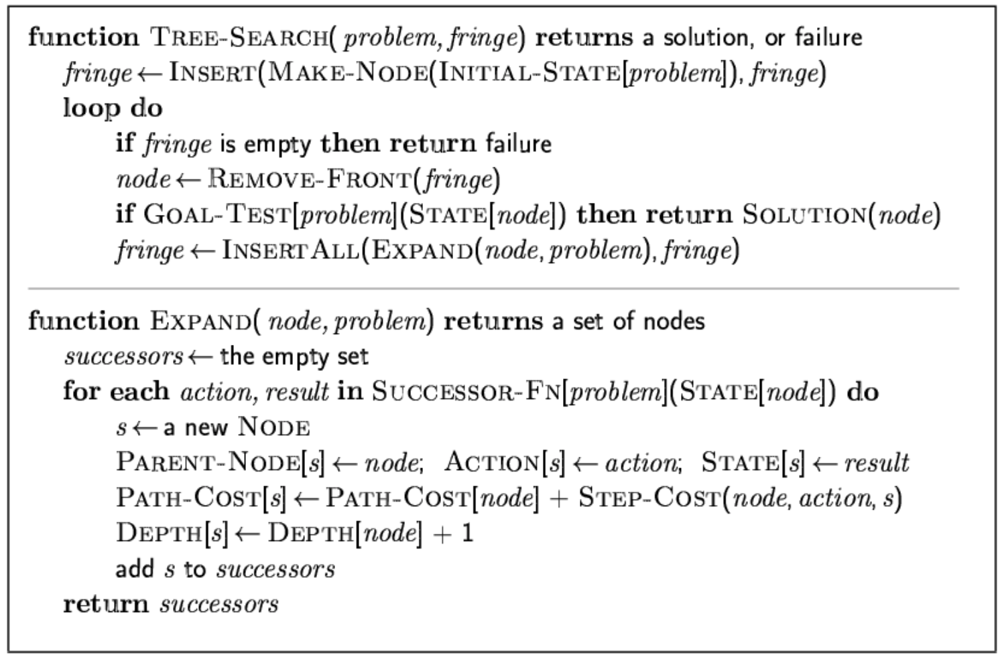
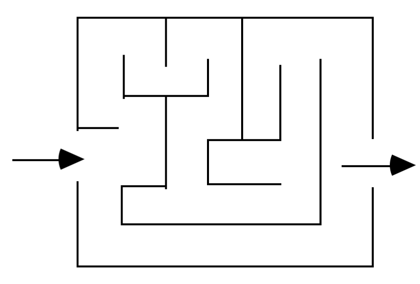

# Searching for solutions

The simplest example we can find is traveling from a point A to a point B, having to find the best path.

When we have to solve this problem automatically, we have to find out what the space is, and the operators that take us to a different space. The process of trying to find the actions that take you from the initial state to the goal is called **search**. We can then build a decision tree, where the root is the **initial state**. Now, there are lots of algorithms that explore the decision tree in different way. The main distintion between these is between the **non-informed** and the **informed**. Informed strategies use the problem knowledge, e.g. if I have to choose between city A,B,C or D, an informed one may choose the nearest one. Informed state strategies are trying to evaluate an action and choose one that is promising.

# Uninformed search strategies

So, we want to **generate a sequence of actions** that bring you from the initial state to the goal. 

- **Expansion**: one starts from a state, and it generates new states by choosing which node to expand. When you reach a leave, it is either a goal or a node to expand.
- **Search strategy**: at each step, choose which state to expand
- **Search tree**

The basic idea is a simulated exploration obtained by expanding states that have already been explored. So you **start** from the initial state, and you **loop**. If you don't have nodes to expand and you didn't find a goal, you've **failed**. If there are candidates, then you have to choose one according to the strategy. 

If the node contains a goal state, we have a solution, so we return the corresponding solution. 

For example, let's say our goal is being in Bucharest, the state is being in a city, and the actions are just travels between connected cities. The solution is the sequence of states that gets you to Bucharest from Arad. 

The problem has four points: the initial state, the successor functions (i.e. actions-state pairs), a goal, the cost of the path, and a solution.

The problem takes a problem, and a fringe, i.e. the available nodes. The action is the operator you can apply. Now, we have to ask ourselves a few questions:

- Can we find a solution?
- Is it a good one?
- What is the cost of the search?

### Evaluating search strategies

We can evaluate a search strategy basing on:

- **Completeness**
- **Time complexity**
- **Space complexity**
- **Optimality**: does it find the *best solution?*

### Non-informed search strategies

- Breadth-first
- Depth-first
- Depth-first limited depth
- Iterative deepening

### Breadth-first search

So, we take the **general search strategy**, then the **breadth-first search**. We firstly have to define *depth*. This search always expands the least deep node. The problem is that you have to keep all the nodes open. The time and space complexities are exponential. This strategy ensures **completeness**, but it isn't efficient. This strategy will always find the shortest path from the root to the goal, *if the cost equals the depth.* If you have a uniform cost, you don't have this guarantee. It will always find the first, depth-wise. 

How do you obtain this strategy? Every time you have a node, you expand it and add the expansion to the tail of your fringe. Therefore, it is FIFO. It is **complete**, with **exponential** time, keeps every node in memory, and **optimal** if cost is 1 per step.

If we now consider the cost, where each node is labelled with a cost, we shall enter the successors in order of increasing path cost.

### Depth-first search

This always expands the deepest nodes. In this case, you don't have to keep a huge fringe open, so the memory cost is super low. You just have to store the nodes of a path. The temporal complexity is exponential, though.
In the worst case, if the maximum depth is $d$ and the branching factor $b$, the maximum number of nodes is $b^d$. 

The algorithm is **efficient**, but **not complete.** The fringe here is a LIFO stack. 

It is **not complete** (it could be, but if fails, for instance, in infinite depth spaces), has **exponential time**, **linear space** (pretty good), and **not optimal**: the solution you find is just a random one. If we have a loop, it loops forever: therefore, it is not complete.

### Limited depth search

This one is a depth first variant. When we reach the maximum depth (previously defined), it explores alternative paths, then alternative paths at less than one unit of depth, and so forth: this thing is called **backtracking**. It is **not complete**: the solution might be at a higher depth, but at least it avoids infinite branches. The implementation has to be **recursive**, we have a flag that defines if we reached the maximum depth. 

### Iterative deepening

This one is a limited depth search, but it increases the depth at every iteration. This solves the incompleteness problem. It has the advantages of depth-first and breadth-first searches, but the drawback is that it analyzes the same nodes a shit ton of times. 

When the search space is very large we can use variants of iterative deepening.

It is **complete**, has **exponential time**, has **linear space**, and it is **optimal**: you always find the shortest path if every step has cost equal to 1.

## Production systems

So, where do we apply these? In **production systems**, systems with rules (set of operators) that tell you how you can move in the search space (i.e. if a given pattern is true, then ...), and databases (working memories, containing the *fringe* ). You just have to state the rules, and then you do not explicitly state the control strategy: it is based on the search strategy. The control strategy selects rules to apply to states of the working memory.  

You can search a space in two ways: 

- Starting from the **initial state** and work towards the goal (**forward reasoning**, or **data driven**). You find the rules that you can apply to the state, then choose.
- Starting from the **goal**, and work towards the **initial state** (**backward reasoning**, or **goal-driven**). Each time a rule is selected and executed, new subgoals to prove are inserted into the working memory. 

You can even mix these two strategies, dividing the working memory into two parts, one containing the facts, the other one containing the goals/subgoals. Termination is achieved when the two portions merge.

# Informed search strategies

Actually, uninformed search strategies are not really used. 

Nobody recognizes intelligence in speed: it is embedded in the exploitation of knowledge. If we have the control on how these solutions are generated, we can find an order in which they appear faster.

Uninformed search methods in a search space of depth $d$ and branching factor $b$ have space complexity proportional $b^d$ to find a goal in one of the leaves.
This is unacceptable for certain problems: therefore, we can resort to expanding the nodes using heuristic domain knowledge (evaluation functions, that give an insight on the effort needed to reach the final state).
The time spent to evaluate a node by means of a heuristic function should correspond to a reduction in the size of the explored space: it has to be worth it!
This is one of the most difficult characteristics of informed search strategies: you just have to try and check. 

Heuristics are not always right! In the following case, the *always move towards the goal* might slow us down a lot.

For example, in the *Game of 8*, we could use the quantity of correct numbers as an estimate of distance from the solution. It is approximated: the distance might actually be more.

### Best-first search

So, **how can we use these?** We have a strategy, called **best-first search**, that is a breadth-first search, but then every node gets tagged by the evaluation function, then the fringe gets ordered with respect to this heuristic! In ***QueueingFn*** we insert successors in descending order of desirability. There are two special cases: *greedy search* (depth-first, goes down in the search tree), and *A\* search*. 

So, now we have a problem: this is not optimal, i.e. it doesn't always find the best solution!

### A* algorithm

This is one of the most used search algorithms. The idea is that we consider **both costs**: the cost we have already traversed AND the cost that we are supposed to traverse in the future. The first is known, the second one is estimated.
We expand nodes for increasing values of $f(n)=g(n)+h'(n)$, where $g(n)$ is the **depth** of the node, and $h'(n)$ is the **estimated distance** from the goal.

If we have a tie, you can have two possibility: choose a **random** one or have a second **heuristic** built to break ties.

The heuristic function $h'(n)$ is said to be **optimistic** if it always underestimates the real distance $h(n)$.
This heuristic is said **feasible**, i.e. it always underestimates.
It is feasible even if $h'=0$ is always true: it will just be a breadth-first search. 

There's a theorem that says that if $h'(n)$ always underestimates, then the A* algorithm always finds the optimal path!

### Eligible functions heuristics

We can define different heuristics. For example, in a tiles game, we could define $h_1$ as the number of tiles that are out of place, or $h_2$ as the sum of the Manhattan distances from the initial and final position for each tile.

### Graphs

We can adapt this algorithm to graphs: we can keep two lists, one for the open nodes (not yet explored) and one for the closed ones. The graph can therefore become a tree with repeated nodes.

If $n$ is the goal we stop, otherwise we remove it from the open nodes and add it to the closed ones, adding its children to the open nodes, labeling them with the cost from the starting node. 

If a child node is already in the open nodes, we update $g(n)$, if it is in the closed ones we don't add it to the open ones but if its cost is better, we update its label. Note that we have to update its subnodes too!

One node can now be reached from different paths, instead of having just one *father*. Therefore, when you re-find a node, you have found another path to reach the same node! You can just choose the best path then. 

