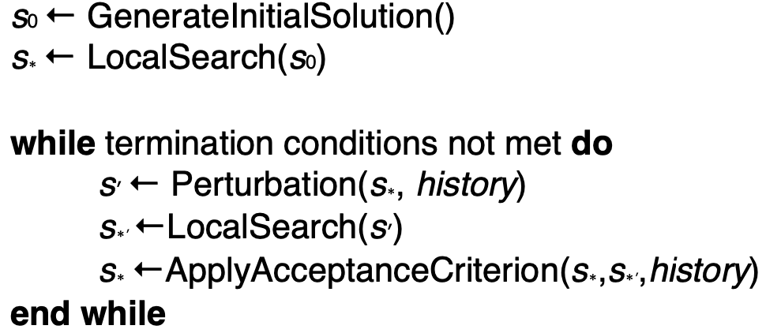
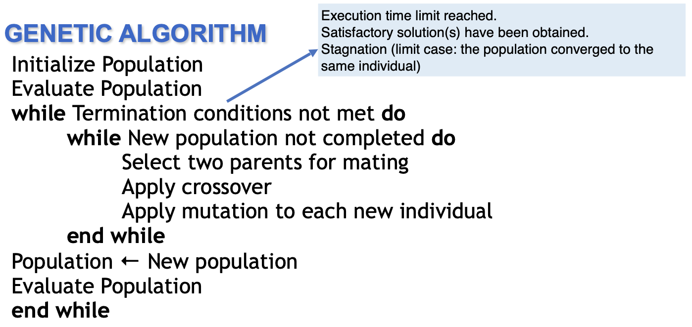

# Local search

90% of problems requiring search are solved through a meta-heuristic. This is nice, tree searches are better but are costly. 

Tree search is a **constructive method**: you start from nothing, and at each step you add a component of the solution. The nice thing is that at each node, you keep all the possibilities open in case one path is not good. 

Local search is completely different. You **start from a solution**, a path, and then you try to adjust or improve this solution through **local moves**.

Given the n queens problem (i.e. position n queens into a chessboard so that they do not attack each other), a tree search would start with the empty board and then every step is **placing a single queen** on the board. 

Local search does it another way: we start by randomly putting the queens on the board. Then, we begin making local moves, i.e. I take a queen and move it. Indeed, I select one queen and explore all the possible moves, than pick one. So, how can we select a new position? We **foresee some improvement.**

In a way, every configuration has a value which measures how good or bad is a situation. 

Every time we define a local move, this move can be applied to a configuration for all possible components: suppose you have a local move that picks up a queen and moves it to the bottom. The same movement could be applied to the other queens too. This is called a **neighbourhood**. It is a function from the **state space** to the power set of this state space. It basically assigns a set of other configurations to a given state, obtainable by local moves. 

In the TSP problem, we obviously want to minimize the cost. We can consider the **2-opt**, i.e. you **remove 2 arcs and intersect them**, still getting an Hamiltonian path. You can observe that one is better than the other one. You can then perform this 2-opt to every other pair of arcs! You can even do the **3-opt**, which does the same with 3 arcs. Obviously, you now have more ways of reshuffling them!

You start from a node, you explore its neighbourhood and check if there's a better configuration. Then, move to that and recompute the neighbourhood, and so on...

**When does this algorithm stop?** When the neighbourhood doesn't contain anything that makes the configuration better. This is called **hill climbing**: you proceed towards an improving solution, until you reach the *peak of the hill*. It's basically a **local minimum** (or iterative improvement), without the certainty of it being a global one. There are several variants, like computing the neighbourhood one-by-one and choosing the first improvement I find, we can pick the best solution, we can stochasticly choose a move...

The High-level algorithm basically states that you:

- S = initialSolution
- loop
  - s = BestOf(s, N(s))
- Until no improvement is possible

**The drawbacks** are that it is **not effective in exploring** the search space (it stops for the first local minimum) and it **does not remember** the already reached search states.

While it is not a good method, it is the basis of metaheuristics.

Note that **the larger the neighbourhood, the more likely a local maximum is global too**.

There are other problems too: **plateau**, when all the neighbouring states have the same value, and **ridges**, a higher area adjacent to where we should go, but we can't go there directly.

The **fitness function** measures how good, or how bad a move is. For example, it might be the cost to cover the distance to the goal.

In the preceding graph, we have the state space (where we have a solution and we want to change it). On the Y axis we can find the objective/fitness function (which is the same freaking thing). The global optimum is the point where the fitness function is better than any other solution in the whole graph, while the local optimum is the same, but just in its neighbourhood.

## Meta-heuristics

These are algorithms that are based on local search, but **have a way of escaping local optima**.

### Simulated annealing

The first we'll talk about is **simulated annealing**, which has origins in statistical mechanics. It allows moves resulting in worsening solutions, with a given probability. This probability is **decreased during search**. At the beginning, it may be high, and we're *free to move around*, than we decrease it during search. 

$p\left(\text { accept up-hill move } s^{\prime}\right)=\exp \left(-\left(f\left(s^{\prime}\right)-f(s)\right)\right) / T$ 

The parameter $T$ is called temperature. You start with an initial solution, you fix the inital temperature at a given $T_0$. Then, the algorithm goes towards hills as always, *otherwise*, if no better solution is available, it accepts a worse solution $s'$ with probability $p(T,s',s)$.

The temperature can be varied in different ways, like the **logarithmic** $T_{k+1}=\Gamma /(\log (k+k 0))$ where the algorithm is guaranteed to converge to the optimal solution with probability $1$ ( but it is very slow), or **geometric** $T_{k+1}=\mathrm{a} T_{k}, \text { where } \left.\mathrm{a} \in\right] 0,[1$, and the **non-monotonic** where the temperature is decreased/increased.

### Tabu search

This is a very high-level algorithm. It works on the concept of memory: it has a **search history** to dinamically change the neighbourhood, and it keeps track of the most recent set of explored configurations, the **tabu list**. Every solution/move (depends on the algorithm) gets tracked in the list: if a local optimum is not so optimum it forbids it. 

$s \leftarrow$ GeneratelnitialSolution()
TabuList $\leftarrow \varnothing$
**while** termination conditions not met
**do**
	$s \leftarrow$ BestOf$(N (s) \backslash TabuList)$ 

​	Update$(TabuList)$ 

**end while**

You can even remove the TabuList (which contains the previous states) from the neighbourhood. If the TabuList is too large, we limit its size.

Sometimes we can store **moves instead of solutions**. 

We can even use **aspiration criteria**, i.e. accept a forbidden move toward a solution better than the current one. 

### Iterated local search

It uses two types of SLS steps: the **subsidiary local search steps** for reaching local optima as efficiently as possible, and **perturbation steps** to effectively escape from local optima.

You start from an initial solution and improve it, perturb (maybe using history), then you improve this perturbated state, and finally decide whether to accept $s$. Every time you perturb your solution, you restart from basically a new solution and improve it!

In literature you can find lots of algorithms. We learned that **modeling is an issue**, high level search strategies **have to be applied** to effectivey explore the state space, the search history is important, and the parameter tuning is critical. 

So, what are the **termination conditions?** While before we stopped on local optimum, what we

## Genetic algorithms

These are inspired by evolution: the good individuals emerge, while the bad ones are subject to extinction. The [fittest individuals have a high chance of having a numerous offspring](https://www.youtube.com/watch?v=hIq4UTgqDAc). 

Before doing anything else, let's define some terms: 

- The **population** is a set of solutions
- Individuals are called **genotypes**
- Chromosomes are made of units called **genes**

We can **crossover** two individuals, and if they are good we can hope that we can obtain a better solution. 

Then, we may have **mutations**, where a small part gets changed.

The **proportional selection** is the process in which the probability for an individual to be chosen is **proportional to its fitness**. So, the new generation entirely replaces the old one, but it may contain some old individuals. It may happen that good solutions are thrown away: we're just using probability. If an individual is very fit, we don't have the deterministic certainty that we'll keep it. 

One possibility is to keep the best $n$ individuals from the old and new solution, or choose any variant. 

When you have a genetic operator, the solution is composed by real values, mutations and crossovers of these. For the latter, how can we create those? We can, for example, linearly combine those like $z=\lambda_1 x+\lambda_2 y$.

Remember that the **initialization is random**.

## Design guidelines

One type of algorithms is the **memetic**, where you start with a population, and for each individual you find the best possible move, such that all the individuals in the population are local optima.

Local search/meta-heuristics are preferable when neighbourhood structures create a correlated search graph, and computational cost of moves is low: inventing moves is easy. 

Population based approach are preferable when solutions can be encoded as compositions of good solutions, computational cost of new solution search is high and it is difficult to design effective neighbourhood structures.

### Software frameworks

There's some frameworks available, like **Comet** or **EasyLocal++**.

