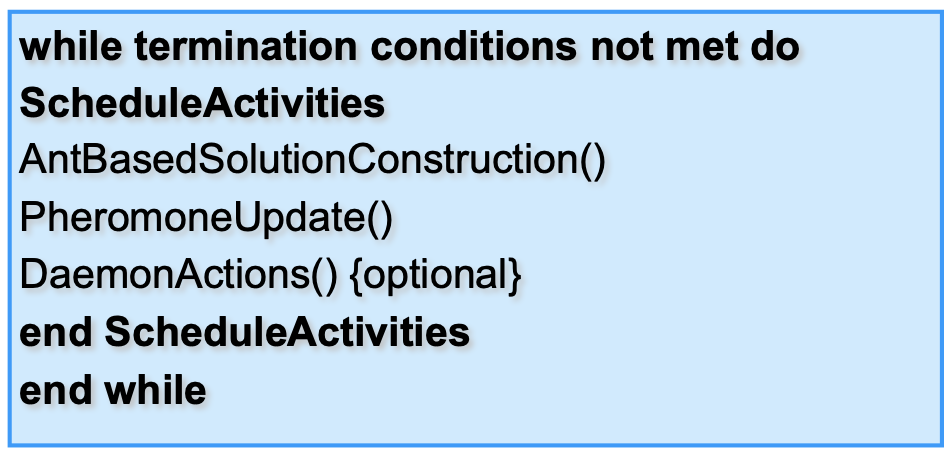
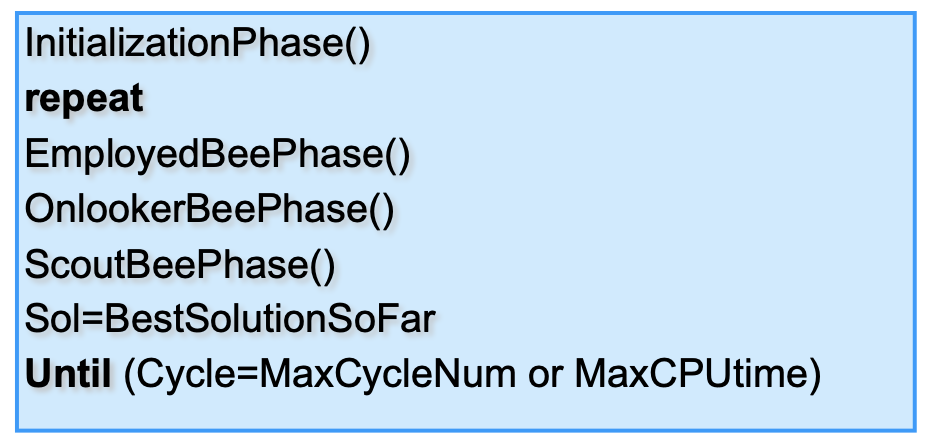

# Swarm intelligence

Swarm intelligence studies the **collective behaviour** of a set of decentralized agents. There is **no centralized control** telling agents how to behave, they simply follow rules.

In a way, the nice thing that emerges is that in many cases, a sort of organized behaviour emerges. SI was born after observing nature, where there are lots of examples of complex structures built by animals, like ant colonies, bird flocks, bacteria molding...

There are multiple studies in which biologists and engineers collaborated (*Kennedy & Eberhart*), stating that we evaluate, compare, imitate, learn from experience, enabling people to adapt to complex environments.

Therefore, culture and cognition are consequences of human social choices.

So, **what are the features of these systems?** (*this might be an exam question*)

The first thing we have to take into account is that the system is composed by a number of **simple individuals**, not able to have sophisticated reasoning techniques. 

They **aren't aware** of the system in its **global view**, nor the goal of the system, just their *local goal* (e.g. find food).

They **interact** through local communication patterns, with mechanisms like *stigmergy*, i.e. an indirect interaction that happens through *changes of the environment*. 

We have **no centralized coordination** of individual activities: the computation is fully distributed.

The idea in human brains is that if you remove a part of the brain, the other parts will take its roles (*graceful degradation*). This thing is applied in SI systems. This means that SI systems are more robust to changes.

**Probability** is important here: nothing is deterministic here!

The ***ingredients*** for an SI system are:

- Multiple interactions among agents: created with **simple agents** in **multi-agent systems**;
- Positive feedback: reinforcing common (good) behaviours, amplificating random fluctuations and structure formation
- Negative feedback: saturation, competition, exhaust resources

## Comunication

Agents can *normally comunicate*, but there's another form of communication which is widely used: **stigmergy**. When ants are moving anywhere, they're leaving a **pheromon trail**, which enables their *swarm movements*.

Basically, in stigmergy agents **change the environment**, communicating.

## Algorithms

We will see 3 algorithms for swarm intelligence:

- **Ant Colony Optimization** (*Dorigo, 1992*): based on ants' behaviour, positive feedback based on pheromone trails;
- **Artificial Bee Colony Algorithm**: we can also have individuals with different functions;
- **Particle Swarm Optimization PSO**: based on the observation of bird flocks or fish shoals. Stigmergy is used as communication.

### Ant Colony Optimization

From the observation of ants we discover that they deposit pheromone trails while walking from the nest to the food and vice versa. They tend to choose the paths marked with higher pheromone concentrations. It emerges that they're always choosing the shortest path to the food.

When you insert an obstacle, these systems tend to be **adaptive**. 

So, how can we translate this behaviour into an algorithm?

First of all, we have to build a **probabilistic, parametrized model**: the ***pheromone model***.

Note that the solution is **built incrementally**: we're not in the field of local searches, we're building the path arc by arc, and at the end we can evaluate the solution.

So, we have a graph called *construction graph* , where vertices  are solution components and arcs  are connections. States are paths on . Constraints can be represented to define what is a consistent solution.

For example, in solving the *Traveling Salesmen Problem*, we can build a model where:

- Nodes of  are cities to be visited;
- Arcs are connections between cities;
- A solution is an Hamiltonian path in the graph;
- Constraints are used to avoid sub cycles: each ant can visit a city once.

The only information that ants have is the pheromon. We'd like to add a little help, then, with some problem specific informations: we add a **heuristic value**. Since our goal is traversing a graph, we can represent background knowledge that is provided by us. We merge the pheromon and the heuristic in a single value, and we'll have a higher probability of choosing the best one. Note that there still is a small probability of choosing the worst path.

So, the algorithm:

InitializePheromoneValues() --> can be 0, resulting in random behaviour

**while** termination conditions not met **do**

**for all** ants  **do**

 <-- ConstructSolution

**end for**

ApplyOnlineDelayedPheromoneUpdate()

**endwhile**

So, how do we select a path? The longer the distance, the lower the heuristic: we prefer shorter arcs. How do we combine them? The **probability** of choosing an arc  is proportional to the pheromone to the power of , the heuristic to the power , divided by the sum of the other possibilities to normalize the thing:

  

This is different from 0 if we have an arc ij. We associate this probability which is proportional to a product of the pheromone trail on that arc times the heuristic that is the inverse of the distance, normalized for all the feasible paths.

We can insert constraints in this problem by, for example, removing arcs from the graph.

The pheromone is updated as long as you find the solution, with the following rule:

 where  is the evaporation coefficient: if nobody uses this arc , the pheromone decreases.

In addition we have to add a value that is the sum, for all ants , of  which means that we take all the solutions, select only the ones using this arc (otherwise it is 0), then we put on this arc an increase in pheromon which is proportional to the total length of the path:

 where  is the length of the path followed by the ant .

where **AntBasedSolutionConstruction** is the building of a solution made by ants, which move by applying a stochastic local decision policy that uses values of pheromone and heuristic, taking track of the partial solutions.

Ants can backward upgrade the pheromone on components used on the basis of the quality of the overalll solution, and evaporation is applied all time.

Optionally, we can introduce `DaemonActions()` which are **centralized actions** that cannot be executed by the single ants. These can provide some global heuristic or collection of global informations: previously each ant updated its own path, but we can globalize the thing adding pheromone to guide search from a global perspective. 

We can even apply local searches to solutions after we've found them.

### Honey bee-colony

Sometimes, we could imagine that the involved agents are not always the same: they may have **different roles**! 

This algorithm is called **honey bee-colony**, and we have **3 kinds of bees**:

- Employeed bees, associated with a nectar source
- Onlookers, that observing the employed bees choose a nectar source
- Scouts that discover new nectar sources

Initially, nectar source are discovered by scouts, then food is consumed and the source is exhausted. The employeed bees in that source become scouts. 

Remember that there are 2 components in the algorithm: **exploration** and **exploitation**, i.e. moving to a different source after finding one, which is what makes this different from a local search. 

Now, the solution is the **position of food** (as many solutions as employed bees), and the **food quantity** for each source.

We have three phases, one for each type of bees, an initialization and a saving of the best solution so far:

In the **initialization**, we want to find  starting points: each bee will start from one of these.

Now, we have a set of employee bees, which travel the the food source area visited in the last cycle, then chooses a new good source in the neighbourhood. We use a fitness function:  

The onlooker bees decide among the solutions, depending on the probability value associated with that source:  

An employeed bee that is performing local search becomes a scout if it can't improve its solution, i.e. *the nectar source is exhausted*.

**Remarks**: The important thing here is that agents have different roles!

### Particle swarm optimization

This is **widely used in robotics**. It was proposed in 1995, and it is still used!

Basically, this was born through the observation of bird flocks: they follow neighbours, stay in the flock and avoid collisions. Usually there's a bird who separates from the flock, then the flock follows it. Every single individual wants to find food, but there's no common objective. What we'd like is having one: with a common objective, a single individual has two choices, i.e. moving away from the group to reach the food, or staying in the group.

We can solve optimization problems with two  The algorihtm moves these particles in the search space through very simple mathematical formulas, deciding direction and speed of movement. The movement is decided by two parts: the best position found by the particle, and the best one found by everyone. This is, in a way, a form of **stigmergy**. 

Mathematically speaking, the move is calculated with  which is the best solution found by the particle  and , the best solution found by the entire swarm. For each particle, we:

- Initialize the starting value  where  and  are the lower and upper boundaries of the search space
- Initialize the particle's best known position to that
- If  we update the swarm's best solution:  
- Initialize the speed  which is a vector of two quantities 

After this initialization, until a termination criteria is met:

- For each particle we move the swarm according to the position and the speed:
  - Pick random  and  
  - Update the velocity  with  and  being hyperparameters
  - Update the particle's position  
  - If   we update the best known position  and if it's the best in the swam we update that too 

## Remarks

Note that these algorithms **have to be non-deterministic**, i.e. working with a *probability*. 

## Parameter tuning

These algorithm are very subject to a good parameter tuning: doing that badly will result in a bad solution!

It is really hard to find the optimal configuration, but there are techniques for automatic parameter tuning like *ParamILS*.

