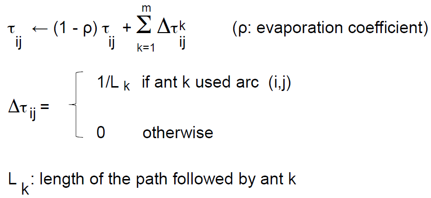

# Swarm intelligence

Intelligence is a result of thinking + social interaction.

A set of simple individuals with limited capabilities, without a centralized coordinator and not aware of the system in its global view nor of its goal. Individuals communicate with direct or indirect local communication patterns. If you remove a small part of your set of individuals the system usually degrades gracefully (the distributed intelligence grants robustness).

Examples in nature are ant colonies, bird flocks, fish schools, ...

Probability is key in swarm intelligence self-organization algorithms. These algorithms usually include positive feedback (reinforce common behaviour, ...) and negative feeadback (move away from exhausted resources, ...).

One notable form of indirect communiation is stigmergy. In nature, for example, ants leave a pheromone trails which suggests the path for other ants. More in general, an agent modifies the enviroinment in a way that influences otyher agents' behaviour. Sometimes the modification to the enviroinment is temporary (for example, the pheromon trail evaporates if its not re-created).

Some notable pratical examples of swarm intelligence: [Swarm-bots](https://www.youtube.com/watch?v=seGqyO32pv4), [Swarm-bots](https://www.youtube.com/watch?v=3YDkbltzMmA), [Swarmanoid](https://www.youtube.com/watch?v=M2nn1X9Xlps)

## Ant Colony Optimization algorithm

Inspired by ant colonies. Stochastic steps on a fully connected graph called *construction graph*.

The column of ants going back and forth between the nest and the food is adaptive, meaning that if a new obstacle is put on the path the ant colony slowly finds the shortest path around the obstacle (shortest path pheromon path gradually outweights the other pheromon paths).

Each connections and solution component (arc of the graph) have a pheromone value $\tau$ (wether the arc is likely to belong to a good solution, it points out the most promising path) and an heuristic value $\eta$ (optional but useful, the length of the arc). Note that by heuristic we don't mean a global heuristic since we don't have a global coordinator. The pheromon value kind of looks like a global heuristic but only in a probabilistic sense, given by the knowledge of the single agents, not by a global coordinator. 

You are not guaranteed to converge to the global optimal solutions. At any time ther could be a portion of the space that is unexplored.

Memory is used to remind paths traversed by the ants. Ants build a solution following a path on the construction graph (choosen with a transition rule) and updating the pheromon values on the basis of the quality of the solution found.

Starting from node i, we have to probabilistically chose the next consistent node to visit.

TODO: INSERT PROBABILISTIC CHOICE INFLUENCING VALUES FORMULA (the verion on the slides used during lesson is wrong, in the denominator $\tau_{ik}$ must be used)

The pheromone is updated with the following rule

