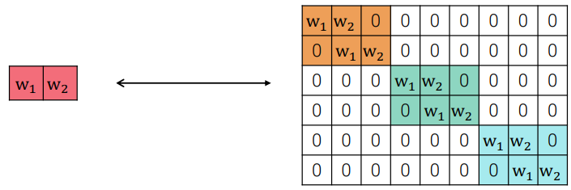
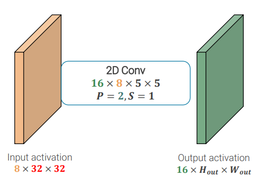

# 5. Convolutional Neural Networks

Convolution can be interpreted as matrix multiplication, if we reshape inputs and outputs. The resulting matrix is a **linear operator** which **shares parameters** across its rows, is **sparse**, naturally adapts to **varying input sizes** and is **equivariant to translations**

Images have 3 channels, so we have to extend our definition of convolution to deal with 3-dimensional tensors. So our kernel will be of size _3 x HK x WK_.

What obtain is still a 2D convolution, but over **vector-valued functions**, and not a 3D convolution since we do not slide over channels. So the output image will have only one channel, which is called feature map or activation map.

We can repeat the process with a second kernel with different weights and so on.

Convolutional layers can be interpreted as a constrained form of linear layers. Hence, they follow the same needing of inserting **non-linear activation functions** between them in order to meaningfully compose them.

## Receptive Fields

The input pixels affecting a hidden unit are called its **receptive field**. For instance, if we apply a _HK_ &times; _WK_ kernel size at each layer, the receptive field of an element in the _L_th activation has size  
_[1 + L(HK - 1)]_ &times; _[1 + L(WK - 1)]_.

If we want to increase the receptive field we can use **strided convolution**.

## Convolution parameters and flops: example

Let's suppose we have an input activation of size 8&times;32&times;32 and a convolution layer of size 16&times;8&times;5&times;5 (16 kernels of size 8&times;5&times;5) without striding (_S_ = 1) and with zero padding equal to 2 (_P_ = 2).

The number of **parameters** needed for the convolutional layer is 16&times;(8&times;5&times;5 + 1) = 16&times;201 = **3216**.

The output activation will have 16 channels, because we have 16 kernels, while height and width will be 32 - 5 + 1 + 2P = 32 - 4 + 4 = 32. So the output activation will have size 16&times;32&times;32, so it is composed by 16&times;32&times;32 = 16384 values (about 64 KB).

Each value is obtained as the dot product between the weights and the input, which requires _n_ multiplications and _n_ summations for an input of size _n_, i.e. _2n_ flops. So, the total number of flops is 16384&times;8&times;5&times;5&times;1 &cong; **2.5M flops**.

## Common layers in CNNs

In ** Convolutional Neural Networks** (short form CNNs), besides convolutional layers, there also other layers:
 - non-linear activations;
 - fully connected layers;
 - pooling layers;
 - (batch-)normalization layers.

### Pooling Layers

 > _“The pooling operation
used in convolutional
neural networks is a big
mistake and the fact
that it works so well is a
disaster.”_
> \- G. Hinton

A pooling layer aggregates sevral values into one output value with a **pre-specified (not learned) kernel** of size _WK_ &times; _HK_, a stride _S_ (usually S > 1). A common choice is a 2&times;2 kernel, with _S_ = 2 and _max_ as kernel function, which is called **max pooling**.

The key difference with the convolution is that **each input channel is aggregated indipendently**, it has no learnable parameters and it provides **invariance** to small spatial shifts.

Withoudtstride (_S_ > 1), pooling itself does not downsample the layer.

## Convolutional Neural Networks

A CNN is composed by _N_ convolutional+pooling layers (+ ReLU) followed by _M_ fully-connected layers, that, all together, compose the se colled **feature extractor**. The last fully connected layer is called the **classifier**.

The problem is that deep architectures following this pattern are **vary hard and/or slow to train**.

This _**could**_ be caused by the fact that the representation _r_ that the classifier (the last fully-connected layer) tries to classify changes at each training. Moreover, the gradient that it receives was computed to improve the performance of the "old" _r_. This phenomenon is called **internal covariance shift**: the change in the distribution of network activations due to the change in network parameters during training.

## Batch normalization

The idea behind batch normalization is to **normalize the output of a layer during training** in order to have zero mean and unit variance in a batch for each dimension and then reintroduce flexibility into the learned representation through **learnable per-dimension scale and translation parameters** _&gamma;__i_ and _&beta;__i_.

**Pros**:
 - allows to use higher learning parameters;
 - careful intialization is less important;
 - tranining is not deterministic, acts as regulatization;
 - no overhead at test time.

**Cons**:
 - it isn't clear why it is so benificial;
 - need to distinguish between training and testing time makes the implementation more difficoult and may be the source of many bugs;
 - does not scale down to micro-batches.
