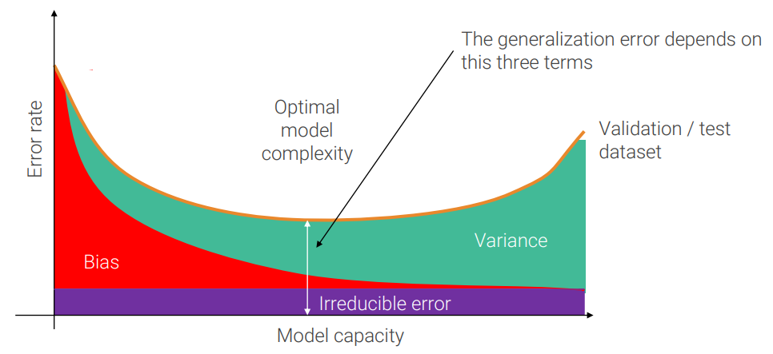

# 7. Regularization

## Model capacity

As we said, the **model capacity** is an indication of **how complex/flexible** the functions that can be learned by the model are.

Increasing the model capacity we are able to fit the moedl better and this is benefitial because it brings down the validation error, until we start to fit also noise and/or urrelevenat features that do not apply well to unseen data (overfitting).

Since the model capacity is a very general indicator, we will focus on single hyperparameters: network width and depth, input resolution, admissible range for values of parameters, training time.

To visualize what underfitting and overffining are, suppose we fit _N_ data points, generated by a noisy quadratic equation_y_ = (_ax_02 + _bx_02 + _c_ ) + _&epsilon;_ with different models, which are polynomials of segree _K_ of the form .

## Bias and variance

The error can be divided in
 - **irreducible error**: distance between the best possible models and the perfect model;
 - **bias**: the distance between the average performance of trained models and one (the closest) of the best possible models;
 - **variance**: the distance between my model and the average performance of trained models.

The previous graph can be now improoved taking in account this division:

We usually do not have _n_ training datasets, but only one validation and one training dataset, so we approximate bias with training error and variance with the difference between training and validation (or test) error.

To get the optimal model is unfeasible to try all possible combination, because is too expensive, so in practice usually you leverage high capacity models to reach low bias and then try to reduce their variance.

This second step of reducing variance usually requires more data, but if ther are not available it's possible to rely on **regularization**.

## Regularization

Regularization is any modification we make to a learning algorithm that is intended to reduce its generalization (test) error, but **not** its training error.

Now we will review specific techniques.

### Parameter norm penalties

When using parameter norm penalties, we add a term to the loss, called **regularization loss**, which guides training to prefer simpler models.

Where _&lambda;_ is a new hyperparameter. Usually _Lreg_ (_&Theta;_ ) is **_l2_** or _l1_ norm.

_l2_ regularization is also called **weight decay** beacuse every gradient descent step drives weights toward the origin (makes them decay) before applying the same update used when regularization is not present.

### Early stopping

Training time is an hyperparameter controlling the effective capacity of the model. By using, at inference time, the best performing model on the validation set, we are effectively selecting the best value for this hyperparameter.

### Label smoothing

Cross-entropy loss has the one-hot encoding of the true label as target. Yet, it can not reach it: to have loss equal to 0, softmax of the correct label should be 1, hence scores should tend to infinite.

Label smoothing assumes that labels are not perfect and smooths them.

## Dropout

In each forward pass, **randomly set some activations to zero**. The probability of dropping is an hyperparameter _p_, usually between 0.5 and 0.2.

The idea of dropout was inspired to Hinton by his bank:

>I went to my bank. The tellers kept changing and I asked
one of them why. He said he didn’t know but they got
moved around a lot. I figured it must be because it would
require cooperation between employees to successfully
defraud the bank. This made me realize that randomly
removing a different subset of neurons on each example
would prevent conspiracies and thus reduce overfitting
