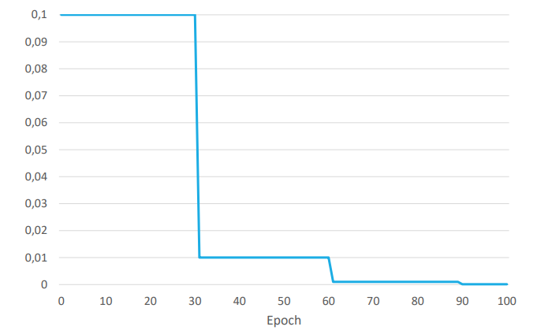
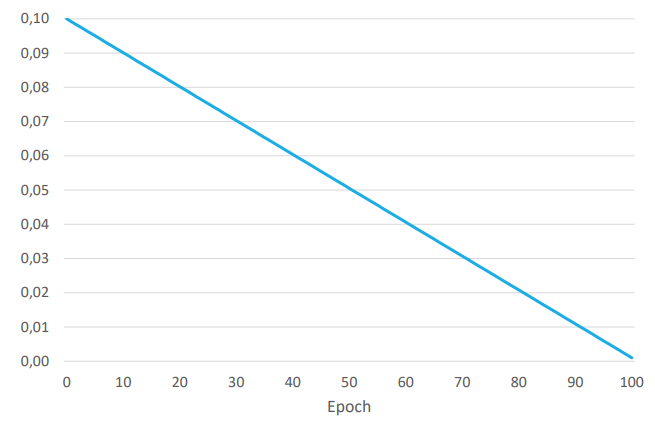
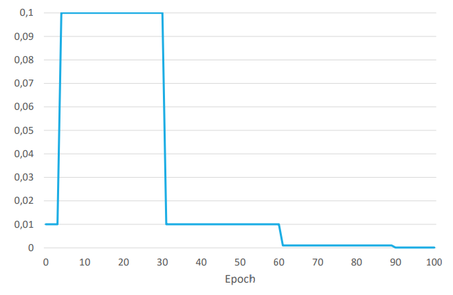
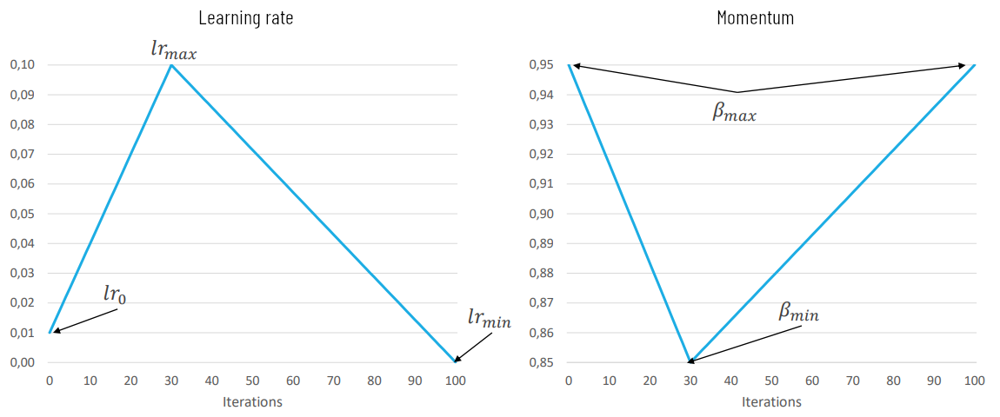

# 8. Practical training and testing

#### Table of contents

- [Learning rate decay](#learning-rate-decay)
  * [Step decay](#step-decay)
  * [Cosine decay](#cosine-decay)
  * [Linear decay](#linear-decay)
  * [Warm-up phase](#warm-up-phase)
  * [One cycle decay](#one-cycle-decay)
  * [Support in PyTorch](#support-in-pytorch)
- [Random Hyper-parameters search](#random-hyper-parameters-search)
- [A recipe for training NNs](#a-recipe-for-training-nns)


## Learning rate decay

The learning rate is a key parameter, but it's hard to find the perfect learning rate.

A common solution, called **decay** or **schedule**, consists of **starting with a high learning rate and reducing it** at the increasing of epochs.

The intuition behind this technique is that when we are oscillating around a minimum due to a too high learning rate we can unstick the situation reducing the rate.

We will now review different ways to reduce the learning rate

### Step decay

The step decay technique, used in [ResNet](6.md#residual-networks-resnet), consists in starting with a high learning rate and dividing it by 10 when the error plateaus.



### Cosine decay

Given a training over _E_ total epochs, the learning rate at epoch _e_ is given by 

It behaves similarly to [step decay](#step-decay) but requires fewer hyperparameters to tune. It's **very used in CV**, but not in other Deep Learning fields.


### Linear decay

Given a training over _E_ total epochs, the learning rate at epoch _e_ is given by 

As the [cosine decay](#cosine-decay), it emulates the [step decay](#step-decay) behavior without hyperparameters, but in an even simpler implementation. It's **very used in NLP**.



### Warm-up phase

For very deep networks, like [ResNet-110](6.md#residual-networks--resnet-), a high learning rate can slow down convergence at the beginning of training. A way to counteract it is to introduce a **warm-up phase** at the beginning of the evolution in which the learning rate is low. After a few epochs, the learning rate becomes high and it is reduced again following one of the decays proposed above. In the following figure, for example, is shown a [step decay](#step-decay) with a warm-up phase.



### One cycle decay

One cycle decay is the **most used decay** nowadays and it **modifies the learning rate after each mini-batch**, also referred to as _iteration_, instead that after each epoch. The original proposal had 3 phases, but PyTorch and other popular implementations provide **two phases**: in the first one the learning rate increases, in the second one, it decreases.

Given a total number of iterations _I_, the learning rate _lr<sub>i</sub>_ for the generic iteration _i_ is


where _p_ &in; [0,1] is a hyperparameter defining the length of the first phase.

This decay also increases the [momentum](3.md#critical-points-and-momentum) _&beta;_ (_&beta;<sub>1</sub>_ in [Adam](3.md#adam)) when the learning rate decreases and vice versa. The formula for the momentum _&beta;<sub>i</sub>_ at the iteration _i_ is:


where _p_ is the same as the formula for the learning rate.



### Support in PyTorch

`torch.optim.lr_scheduler` provides several methods to adjust the learning rate based on the number of epochs.  
`torch.optim.lr_scheduler.ReduceLROnPlateau` allows dynamic learning rate reducing based on some validation measurements.

**Learning rate decay should be applied after optimizer's update**, so the code should be something like this:

```python
scheduler = ...
for epoch in range(100):
  train(...)
  validate(...)
  scheduler.step()
```
```python
def train(...):
  ...
  opt.step()
  ...
  opt.zero_grad()
  ...
```

## Random Hyper-parameters search

To search best combinations of different hyper-parameters a possibility is grid search, but it does not perform well when some parameters are way more important and influential than others. This is why a **random search** leads to a more efficient exploration of space.


## A recipe for training NNs

> _… suffering is a perfectly natural part of getting a neural network to work well, but it can be mitigated by
being thorough, defensive, paranoid, and **obsessed with visualizations** of basically every possible thing.
The qualities that in my experience correlate most strongly to success in deep learning are **patience and
attention to detail**._ - Andrej Karpathy

This part of the lesson summarize what is written in [_A Recipe for Training Neural Networks_](https://karpathy.github.io/2019/04/25/recipe/), a post in Andrej Karpathy's blog, which is strongly recommended to be read entirely.

The following step-by-step guide is just for recap purposes, **you should study directly on the blog**.

 1. **Become one with the data**: collect statistics but also look at the data and understand them.
 2. **Set up the end-to-end training/evaluation skeleton + get dumb baselines**: check all the infrastructure code before training complex models, check init loss, overfit a small dataset, etc...
 3. **Overfit**: reach low [bias](7.md#bias-and-variance) by starting with known models + [Adam](3.md#adam), then explore.
 4. [**Regularize**](7.md): apply [data augmentation](7.md#data-augmentation), [norm penalties](7.md#parameter-norm-penalties), [dropout](7.md#dropout), [stochastic depth](7.md#stochastic-depth), etc.
 5. **Tune**: [random search](#random-hyper-parameters-search) for better hyper parameters around what worked in 3-4, use [LR schedules](#learning-rate-decay).
 6. **Squeeze out the last drop of performance**: ensembles and/or SWA.
 
