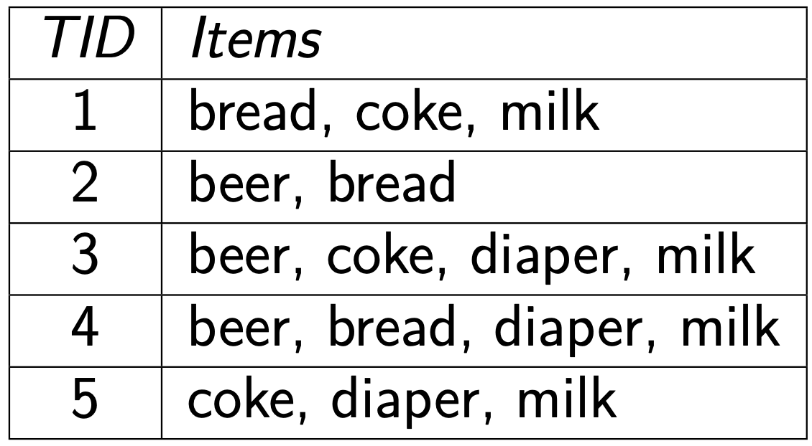
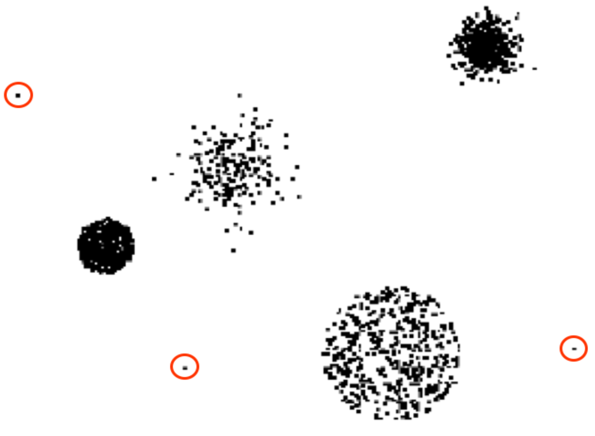

# Data and datasets

So, **what is a dataset?** It is a set of $N$ individuals, where each individual is described by $D$ values. In essence, it can be seen as a *relational table* with $N$ rows and $D$ columns. 

Let's first start with some issues on the data: of course, data is raw material, so there's lots of issues. Data can be qualitative or quantitative. Data are **never perfect**. Nowadays, with the automatic collection of data, problems are reduced but still exist. There can be **outliers**: a small amount of data which are different from the others, due to anomalies/errors, but could even represent *surprising* data. Some mining techniques are **more robust** than others.

**Better data quality usually implies better insights.**

Therefore, pre-processing activities are essential.

We could have a quick look at a few examples from the [**UCI ML repository,**](https://archive.ics.uci.edu/ml/index.php) and find things like:

- Iris
- Adult
- Breast Cancer
- Wine quality
- Car evaluation

### Data types

Data can be expressed in **various ways**. It can be made of *numbers, letters, classes, symbols.*

Generally, we speak about **numbers** (*quantitative information*), and **labels** (*qualitative information*).

When speaking about **numerical data**, we divide it into:

- **Interval**, where the difference is meaningful, like dates
- **Ratio**, which have a univocal definition of 0, like degrees

When dealing with **categorical data**, we divide it into:

- **Nominal**, a set of labels, where the information allows us to distinguish a label from another one but not order them (for example, male/female)
- **Ordinal**, where the values provide enough informations for a total ordering (for example, when labelling low/medium/high)

**What are the possible transformations?** For **nominal** data, we can do every possible one-to-one correspondence, e.g. the Social Security Number can be arbitrarily reassigned. For **ordinals**, we must preserve the order, e.g. low/medium/high --> 1,2,3. For **intervals**, we can use linear functions. For **ratios** we can use *any* mathematical function.

### Number of values

We can distinguish between **discrete domains** and **continuous domains**. Nominals and ordinals are *discrete*, possibly binary. Intervals and ratios are *continuous*. 

### Asymmetric attributes

In asymmetric attributes, only the presence is considered important (a non null value). Presence is more significant than absence. 

### General characteristics

It's best to discuss some features:

- **Dimensionality**: we can talk about large data and tall data. The difference is also qualitative: when d is big, some operations perform badly
- **Sparsity**: when there are many zeros/nulls
- **Beware the disguised nulls**: a widespread bad habit is to store zero or special values when an information is not available
- **Resolution**, has a great influence on the results, too detailed data can be affected by noise, while too general data can hide patterns

### Data matrix

What's a data matrix? It can be seen as a relational table, **with a constraint**: we expect all the attributes to be numeric. This way, we can interpret every row as a point in a vector space with N dimensions, where N is the columns number. 

### Document representation

This type of data is related to textual representation, i.e. a sequence of words. So, how can we represent documents for the sake of ML? Of course, a text is a complex sequence, but a way to represent a document array is the representation of the contained words. 

### Transactional data

Here, each record contains a set of objects. Strictly speaking, it is not a relational table: we have a variable number of elements!

An example might be the market basket:

### Graph data

These are used in webpages, set of nodes and arcs, molecular structures...

### Ordered data

This represents some kind of space, spatial data, temporal data, sequential data, genetic bases...

## Data Quality

So, which are the **possible problems**, how can we **detect** and **solve** them? Some examples of problems might be noise/outliers, missing values, duplicated, inconsistencies...

### Noise

Noise is a modification of the original value, uninteresting mixed to the interesting data.

### Outliers

The **outliers** are data whose characteristics are considerably different from most of the data in the dataset. For example, the red-circled dots are outliers.

If you look at the other points, each of them has many *neighbours*, while the red-circled don't.

### Missing values

Sometimes, data were not collected or the information is not applicable (e.g. income for a children). So what can we do with missing values? We can **skip** objects with missing values, remove the column itself (if all the missing values are in the same column), estimate them/default, insert all the possible values (weighted with probability).

### Duplicated data

This situation is *quite common* when we are merging data from **different sources.** We can therefore clean the data, but it's pretty difficult.

# Testing strategies

In every step, the data should be representative of the data that will be classified at run time. We can do an **holdout**, which means that we split the data into a *training set* and a *test set*, or even add a *validation set*. To have a **cross validation**, we can repeat the tests with different splits. 

## Cross validation (k-fold)

Here, the training set is randomly partitioned into k​ subsets, and if necessary we use stratified partitioning: the concept of stratification means that if we have, let's say 2 classes, with frequency f and 1-f we want that this frequency is kept in the sets. K iterations using one of the subsets for test, and the others for training. We then combine the result of tests, and generate the final model using the entire training set. This is **k** times slower, but provides an optimal use of the supervised data: each record is used $k-1$ times for training and once for testing.