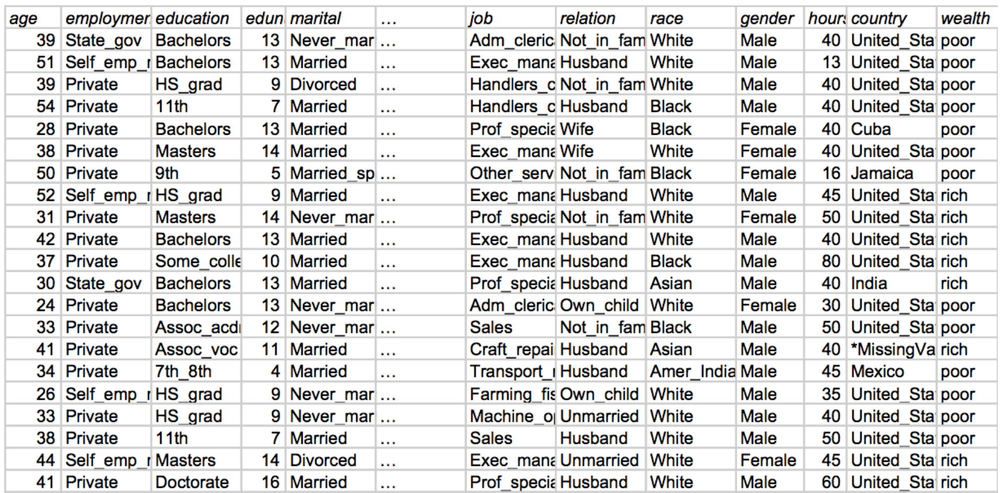
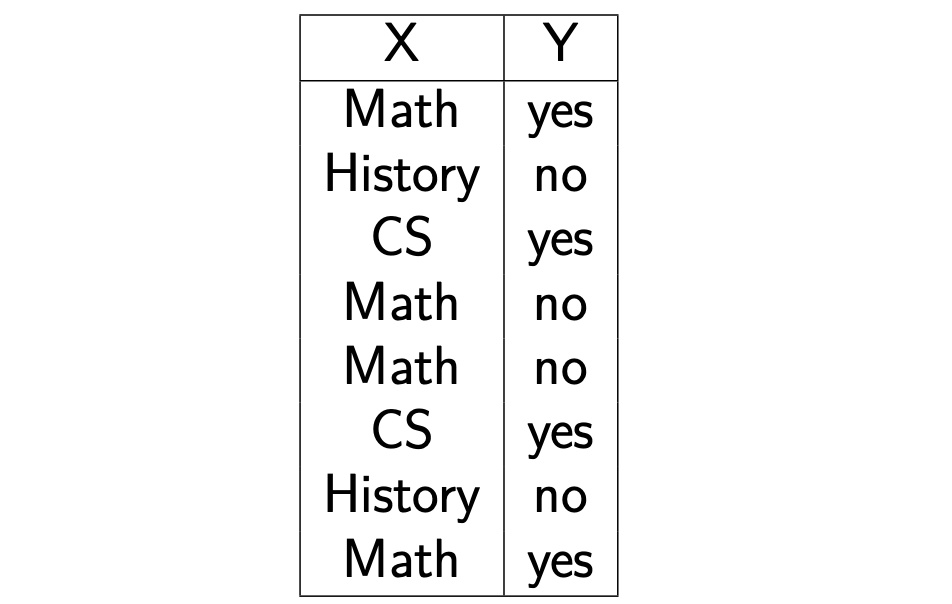
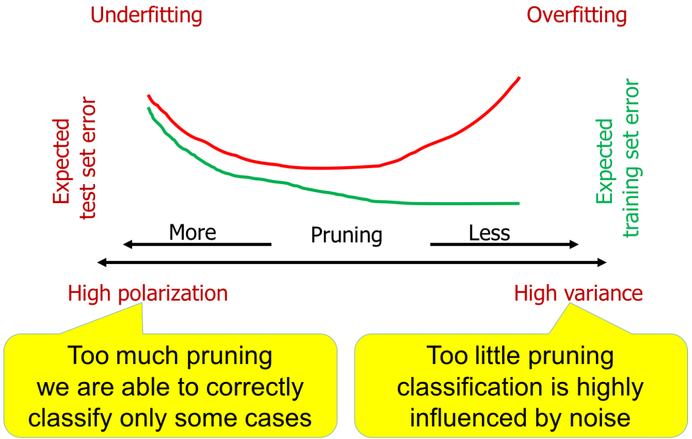
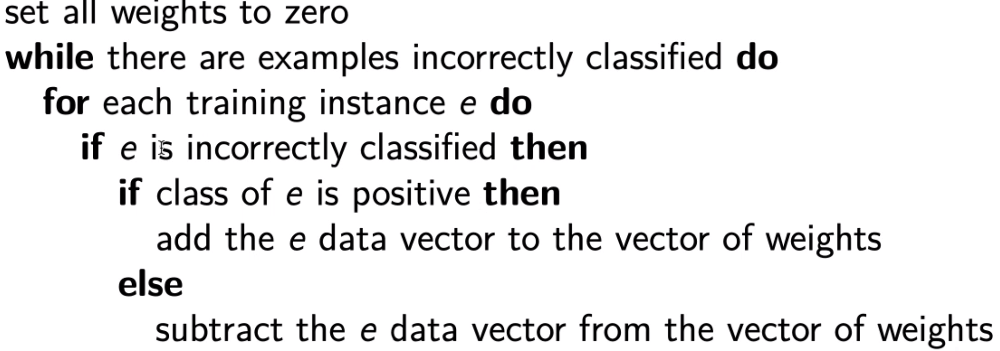
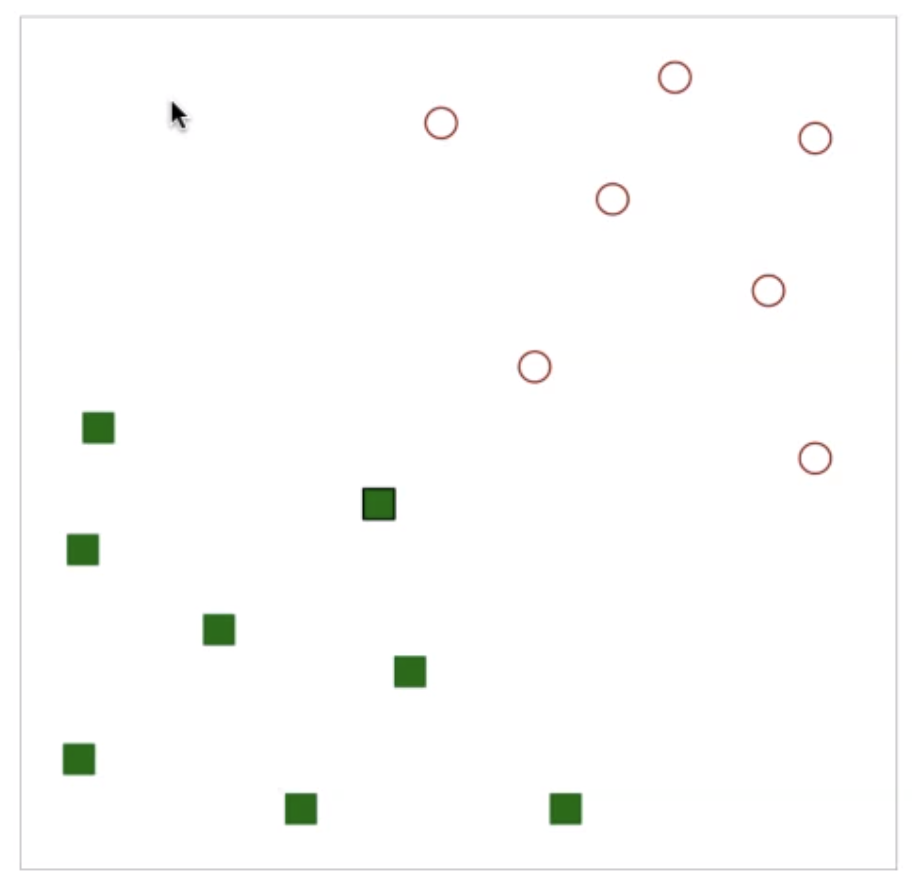
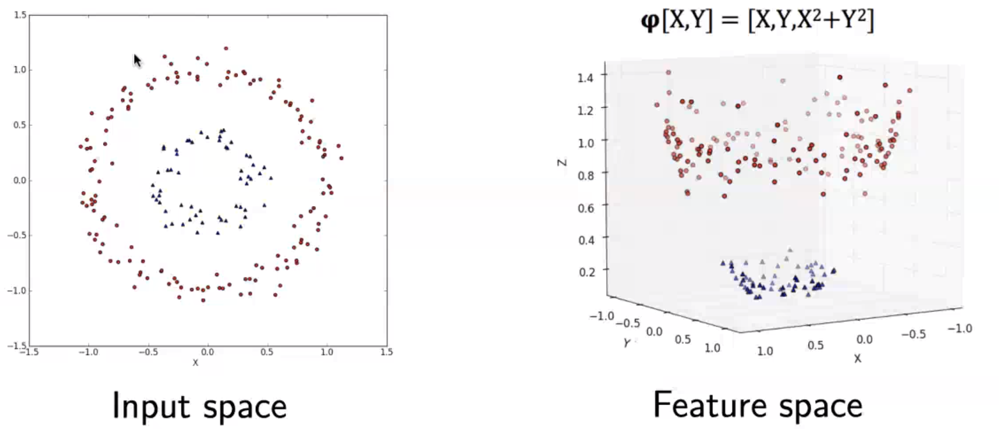
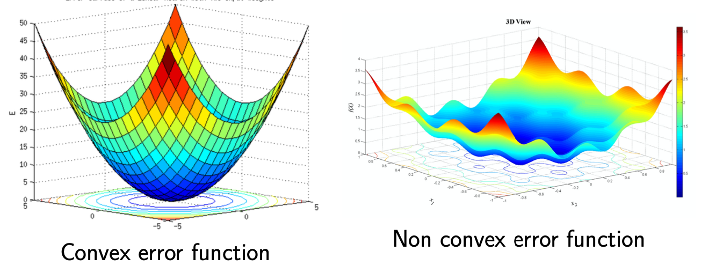

# Classification

Given a dataset composed of D attributes, one of these is the **class**, i.e. a finite value provided by the supervisor. We want to learn how to guess the value of the D-th attribute (class) for individuals which have not been examined by experts.

## Classification model

It is an algorithm which, given an individual for which the class is not known, computes a guess of the class. In general, the algorithm can have different _flavors_ distinguishable by _parameters_: some values which can be tuned to influence the quality of the result.

So, we'll want to choose the learning algorithm, let the algorithm learn its parametrization, then assess the quality of the model.

We'll learn using a **training set**, which contains already classified individuals. This will obviously have to be similar to the other ones, as to be representative. When the learning is done, we want to **estimate the accuracy**, for which we'll use a new set, already labeled, to check if the model computes them right.

There are two _flavors_ for classification:

- **Crisp**: the classifier assigns to each individual one label
- **Probabilistic**: the classifier assigns a probability for each of the possible labels

## Classification with decision trees

Decision trees have a quite long story, and have been improved in several ways.

A tree has inner nodes. We start from the root, with a test. For instance, we could test an attribute $d$ of an element <!-- $e$ --> . If, for example, <!-- $x_2>5$ --> , we'll execute the right node, if not we'll execute the left one. Than, the same thing happens with the inner node. When we come to an end, it will be a prediction, i.e. a **leaf node**. The thing is: we've gotta learn what decisions to put in the decision tree, and this is what the training aims to achieve.

Given a set <!-- $\Epsilon$ -->  of elements, we'll grow a decision tree as follows:

- If all the elements belong to a class <!-- $c$ -->  or if <!-- $E$ -->  is small, generate a leaf node with label <!-- $c$ --> 
- Otherwise, we choose a test based on a single attribute which may have <!-- $N$ -->  (at least two) outcomes, and will become the root of <!-- $N$ -->  branches

There are many problems to solve: which attribute should we test, which kind of test, what does _<!-- $E$ -->  is small_ mean?

So, given a census dataset, we may ask ourselves: _can we learn the wealth attribute just by looking at the other ones?_

Let's first perform an **exploratory analysis**, i.e. looking at the data, maybe generating histograms...

We could generate a k-dimensional contingency table, through SQL or whatever. Contingency tables could give us an insight on correlations between attributes, but we could need lots of them! _A shit fucking ton of 'em!_

So, how can we evaluate if a pattern is interesting? To do so, there are several methods. One of them is based on _information theory_, born thanks to the concept of entropy.

To introduce this concept of entropy, an example is needed. Given a variable with 4 possible values and a given probability distribution, an observation of the data stream could return BAACBADCDA. If I want to transmit to a remote agent those readings, I can encode them for instance with two bits, (00,01,10,11). Therefore, the transmission will be 01000010010011101100... But what happens if I the probability distribution is uneven?

<!-- $P(A)=0.5, P(B)=0.25, P(C)=0.125, P(D)=0.125$ --> 

Of course, the already said coding works, but we could do better: there's a coding requiring a smaller average of bits per symbol:

<!-- $A=0, B=10, C=110, D=111$ --> 

Even with 3 symbols with equal probability, this technique could save bits!

In the general case, given a source <!-- $X$ -->  with <!-- $V$ -->  possible values, with their probability distribution, the best coding allows the transmission with an average number of bits given by <!-- $H(X)=-\sum_j p_j log_2(p_j)$ --> . <!-- $H(X)$ -->  is the entropy of the information source <!-- $X$ --> .

### Meaning of entropy of an information source

High entropy means that the probabilities are mostly similar. Low entropy means that some symbols have much higher probability. Higher number of allowed symbols gives higher entropy.

In a binary source, the entropy goes to 0 when one of the probabilities goes to 1 and the other to 0.

So, what is the purpose of these considerations on entropy? Let's consider a toy example, where in the <!-- $X$ -->  column is the graduation of a friend, and the <!-- $Y$ -->  column contains whether the person likes _Joker_ or not. We can derive the probabilities from value frequencies.

Now, let's consider the entropy of Y considering only the rows in which <!-- $X=v$ --> . When we filter by Math, the entropy stays 1, but when we filter by History, the entropy goes to 0.

This could also be interpreted as the minimum number of bits needed to transmit the value if the receiver know <!-- $X$ --> . So, the conditional specific entropy is:

<!-- $H(Y|X)=0.5$ --> , therefore, <!-- $X$ -->  provided some insight on <!-- $Y$ --> .

Now, how can we decide if a person likes _Joker_ or not?

### Information Gain

Now we can formally define the **Information Gain**, which states the amount of insight that <!-- $X$ -->  provides in the forecasting of $Y$.

<!-- $I G(Y \mid X)=H(Y)-H(Y \mid X)$ --> 

So, **how can we use** the information gain? It could help us predict the probability of long life given some historical data on person characteristics and life style. _Higher IG means that a 2D contingency table would be more interesting._

Getting back to the decision tree, **how can we decide which attribute to test?** Now the answer is obvious: we should choose the one with the maximum information gain for the class in the dataset! Having decided this, we'll now have a number of subtrees to generate.

Deciding the attribute giving the highest IQ couldn't always be the right choice. But we'll get to this later.

So in the end, the algorithm looks like this:

We'll execute the generated decision tree on the training set itself, count the number of discordances, thus obtain the **training set error**. Obviously, when trying to use the tree with the test set, the error rises.

Is there any general lesson we can learn from this fact? With a smaller tree we increase the training error, but we decrease the test error. Bigger trees are more prone to overfitting.

## Overfitting

In real life, there's noise in data. The ability to predict classes is indeed not perfect, and we'll sometimes make wrong predictions. **Overfitting** happens when the learning is affected by noise.

Stating this in a formal way, while a decision tree is a hypothesis of the relationship between the predictor attributes and the class. If <!-- $h$ -->  is the hypotesis, we can define the error of the hypothesis on the training set <!-- $error_{train}(h)$ --> , and the error of the hypothesis on the entire dataset <!-- $error_{\epsilon} (h)$ --> . $h$ overfits the training set if there is an alternative hypothesis <!-- $h'$ -->  such that

<!-- $error_{train}(h)<error_{train} (h')$ --> 

<!-- $error_{\epsilon} (h) > error_{\epsilon}(h')$ --> 

Overfitting is caused by two phenomenons, the **presence of noise** and the **lack of representative instances**.

**Everything should be made as simple as possible, but not simpler.**

**Pruning** a decision tree is a way to simplify it.

Pre-pruning means early stopping the tree while it is growing, post-pruning is a pruning done after the tree is finished.

The **validation set** is a third dataset, which we can use after the pruning. In this way, my set will be more reliable: I'm using fresh data.

There are many ways to prune data, one of these is the **statistical pruning**: it uses statistics to infer if a new node I'm generating is prone to being affected by noise.

The **minimum description length principle** states that when the complication is bigger than the reduction of errors we are basically wasting our time.

The supervised data are then split in 3 parts:

- **Training set**, to build the model;
- **Validation set**, to tune the model and minimize the error;
- **Test set**, to assess the final error.

### Minimum Description Length

This is another _way of thinking_. We know that the learning process produces a theory on a set of data, which can be then used to predict the class on a set of data. So, how can we describe this theory? We could encode the theory, and the errors underneath. So, the length of the theory is the sum of the length of the tree + the length of the errors. So, the **Minimum Description Length Principle** states that we should choose the theory with the **shorter description**: a bigger theory includes bigger errors. In the extreme cases, we may have a very simple theory with lots of exceptions, and a very complex theory with a few exceptions.

A decision tree is not **extremely powerful**: it's a compromise, it works and it's not too computationally heavy. We should choose a single attribute to train it, otherwise it might get too complicated.

### Characteristics of a decision tree

It is a **non-parametric approach** to build classification models. Finding the best one is **NP complete**, while the heuristic algorithms allow to find sub-optimal solutions in reasonable time. The run time use of a DT to classify new instances is extremely efficient: <!-- $\mathcal{O}(h)$ --> , where $h$ is the height of the tree.

### Choosing the attribute to split the dataset

We're looking for the split generating the maximum **purity**. We can use some functions, like **Information Gain**, **Gini Index**, **Misclassification Error**, the latter being the worse one.

Of course there are several variants for building these trees, we can use different strategies for the construction, the pruning...

# Evaluation of a classifier

**Model selection** is essential to the good design of a classifier: when I have hyperparameters to tune, I need to select several alternatives. But in practice, when we say model selection we go to a _higher level_, because we can select between different learning algorithms too. We could also go further: before feeding the data, we can transform them!

We need **measures** to compare different algorithms, strategies, etc... and choose the best one!

Empirically, the more training data we have the best we train the dataset.

We can define a **confidence interval**, a concept that derives from the Bernoulli process, i.e. forecasting each element of the test set is like one experiment of a Bernoulli process, a binary success/failure. 

Therefore, the empirical frequency of error is <!-- $f=S/N$ --> .

With some algebra we can compute the **Wilson Score Interval**, which is the abscissa delimiting the area <!-- $1-\alpha$ -->  for a normal distribution. The formula doesn't have to be remembered.

So, <!-- $\alpha$ -->  is the probability of a wrong estimate. Increasing <!-- $N$ --> , with constant empirical frequency, the uncertainty for <!-- $p$ -->  narrows. 

## Accuracy of a classifier

Accuracy and error frequency are complements (<!-- $A=1-e$ --> ). Error frequency is the sum of errors of any class, divided by the number of tested records. A good statistic could be the maximum error frequencies instead. 

So, why should we use other statistics? Maybe, estimating the cost of errors might need more statistics.

Every ML algorithm has hyperparameters to tune, and several training loops are usually needed to find the best set of hyperparameters.

It is crucial to obtain a higly reliable estimate of runtime performance. Sometime it is necessary to find the best compromise between the optimisation step and the quality of the result. 

The train/validation loop is usually faster than cross validation. 

## Performance measures of a classifier

We already know what the accuracy is. For the moment, let's consider **binary predictions**. There are other possible indicators, like velocity, robustness, scalability, interpreatability. A classification error could have different consequences, which could be dangerous!

Another important measure is the  **f-measure**, i.e. the harmonic mean of precision and recall, aka F1 score or balanced F1 score: <!-- $F=2\frac{precision\cdot recall}{precision+recall}$ --> .

### Beyond the accuracy

When we evaluate the quality of a classifier, we should also take into account the *a-priori* information, i.e. the distribution of our supervised data. If the classes are perfectly balanced, we'll be correctly guessing the accuracy, but by chance. If, instead, our dataset is heavily unbalanced, like in the case of a disease with 2% of positivity.

So, when we evaluate a prediction, instead of just using accuracy, we should use a metric that considers the distribution. 

So, considering a confusion matrix with 3 classes, we have accuracy <!-- $\frac{\sum TP_i}{N}$ --> , precision <!-- $\frac{TP_i}{P_i}$ -->  and recall <!-- $\frac{TP_i}{T_i}$ --> . There will obviously be a number of false predictions. So, let's say that the classifier <!-- $\overline{C}$ -->  generates this confusion matrix. Then, we have 200 predictions, in 100:6:40 proportion, of which 140 are correct. 
If we had a random classifier <!-- $R_{\overline{C}}$ -->  which generates the same proportion, but randomly, 82 predictions are exact **by chance**. The improvement of <!-- $\overline{C}$ -->  over <!-- $R_{\overline{C}}$ -->  is 58. We now can define <!-- $k(\overline{C})=58/118=0.492$ -->  as the **improvement** of the classifier wrt the improvement of the perfect classifier.

This statistic evaluates the concordance between two classifications. 

<!-- $k$ -->  is therefore the ratio between the concordance exceeding the random component and the maximum surplus possible. -1 means a total disagreement, 0 a random agreement, 1 total agreement.

### Cost of errors

Our decisions are driven by predictions, and bad predictions imply a **cost**.

The easy solution is computing the weighted cost of errors, i.e. errors which have an higher cost should be avoided more. We can even alter the dataset by duplicating the examples for which the classification error is higher, in this way the classifier will become more able to classify the classes for which the error cost is higher.

## Evaluation of a probabilistic classifier

So, up to now we were considering a **sharp** classifier (crisp prediction), giving an exact answer. What if we were working with a probabilistic classifier?

If we need an instant decision, a crisp classifier is good, but if the classification is part of a bigger process involving several evaluations, a probabilistic output could be more accurate.

### Lift chart

This is used to evaluate various scenarios, depending on the application. Let's consider a dataset with 1k positives and apply a probabilistic classification scheme. We want to make a bidimensional chart with two axis, shere  is the sample size, and  the positive samples. 

Now, a straight line plots the number of positives obtained with a random choice of a sample of test data, while the curve plots the number of positives obtained drawing a fraction of test data with decreasing probability. So, with the *sorting* I generated with my classifier, if I take the first 10% of my dataset we're able to get 400 positives. To reach another 400, we need to get to 40%. 

So, this line is the number of positives I get with my probability classifier. The larger the area between the two curves, the best the classification model.

### ROC curve

The ROC curve describes a tradeoff between the hit rate and false alarm in a noisy channel. The noise can alter the recognition of the transmission, and alters the two levels according to a gaussian.

With less noise the two gaussian are better separated. 

Moving the threshold, we change the ration between false positives and false positives. A good classifier gives us an increase in TP with a small increase in FP.

Threshold steps allow to track the ROC curve: we sort the test elements by decreasing positive probability, set the threshold to the highest probability, then move.

Decreasing the threshold increases the recall.

# Transforming a binary classifier into multiclass

Why this? We have seen that DT are able to classificate non-binary target and binary, but other classifiers cannot. How can we adapt a binary classifier to a non binary problem?

They are One vs One, and One vs All.

So, the idea is to use a set of binary classifiers and combine the results.

## One vs One

We have 3 or 4 classes, , we generate a binary classifier for each pair of classes:  

Of course, each binary problem will be trained with the 2 classes. Then, at prediction time, we will use all the classifiers: for the right classifier, it will be right (there are 3 classifiers with the class), the others will have a random example. So, we count the maximum class, and that will be it. 

## One vs Rest/One vs All

We now consider  binary problem, where class  is a positive example, and all the others are negatives. We'll have  classifiers, producing a *confidence score*, then choose the one with the maximum confidence. 

So, OVO requires a higher number of problems, while OVA tends to be intrinsically unbalanced.

## Ensemble methods

We now consider methods related to this. We start training a set of **base classifiers** instead of a single one. Then, we obtain a final prediction taking the votes of the base classifiers. This works better than a single classifier. 

Why is that? Let's consider 25 binary classifiers, each of them having an error rate .

If we put them together, the error becomes:  

Of course, if we are using 25 times the same classifier, which is a deterministic machine, this reasoning doesn't work. But if they are different and independent, this makes it better!

So, the ensemble will be wrong only if the majority is wrong, i.e. it will probably be statistically right!

### Rationale for ensemble methods

We can obtain good results only if the base classifiers are independent, and the performance of the base classifier is **better than a random choice**.

So, how can we make them independent? We can, for example, train them on different datasets (i.e. partition the dataset). There are other methods too: **bagging** (repeatedly sampling with replacement according to a uniform probability distribution), **boosting** (iteratively change the distribution of training examples so that the base classifier focuses on examples which are hard to classify), **Adaboost** (the importance of each base classifier depends on its error rate).

Another possibility, instead of working **horizontally**, is working **vertically**: we partition the columns!

What should we consider? The correlation with the goal, the independency/correlation between columns...

**Random Forest** is a variant of DT which works on these principles.

There's another possibility, **manipulating class labels**, which we do when we have many class labels: this usually makes the classifier bad. So, we randomly partition the classes into two sets, and relabel the dataset. Then, we train binary classifiers as a *tree*, like a binary search. 

# Naive Bayes Classifier

We can classify with methods different from a decision tree.

We'll start with the **statistical modeling**, which is strictly related to the Bayes' theorem.

We now consider the contribution of all the attributes of the dataset, assuming that each one of them if independent from others, given the class. So, the probability can be rewritten as a **joint probability**.

We'll use the empirical frequency as probability.

Considering a toy example, with temperature, outlook, humidity, wind, we have a target **are we going to play or not?**

So, the task is, given the features, are we going to play? We'll deal with this as a statistical problem, considering the features as **equally important** (they're independent evidence). We then obtain the likelihood of yes and no, then normalize to 1, getting  and .

So, in principle, things are not complicated. How can I train this classifier? I need to scan my dataset and compute those frequencies. 

This works thanks to the Bayes' theorem , and the hypothesis is the class, say , the evidence is the tuple of values to be classified. We can then split the evidence into pieces, one per attribute, and if the attributes are independent: .

## The Naive Bayes method

We can compute the probabilities for the classes, then choose the one having the maximum likelihood. It is **naive** cause the assumption of independence is quite simplicistic. 

The problem is that we can overcast to a 0 probability of No, which kills our formula by setting everything to 0.

Therefore, we can apply a smoothing technique, the **Laplace smoothing**, which uses a parameter  (typically ) let's say we have an absolute frequency of  in attribute  over class , then  the number of distinct values, and the absolute frequency  of class  in the dataset. The smoothed frequency is: 

When , the formula is unsmoothed, but higher values of  give more importance to the prior probabilities for the values of . This means that this frequency will be smaller if we have a higher number of values. The  component is basically the prior probability. So,  allows us to mix the prior probability with the current value. Smoothing is necessary when some frequencies are zero, and it reduces overfitting.

So, the components of this classifier are **independence** and **smoothing**.

If there's missing values, we may have another problem. In decision trees, we either remove the column or the row (or try to guess). 

With the Naive Bayes Classifier, **they do not affect the model!** We simply don't include the record in the frequency count: it's not a big deal.

So, here we have seen how we can count for categorical attributes. What happens if we have numerical attributes? We do an additional assumption: the values have a **Gaussian distribution**.

Instead of fraction of counts, we can now compute the mean and the variance of the values of each numeric attribute per class.

For a given attribute and class, the distribution is supposed to be 

The probability of a value assuming **exactly** a single real value is zero. A value of the density function is the probability that the variable lies in a small interval around that value. The value we use are of course rounded at some precision factor, i.e. the same for all classes. Null values don't break the algorithm. 

So, what can we say about this classifier? First of all, the semantics is clear. In many cases, it works well (e.g. spam filters). It is obviously simplicistic. If there's no independence, we get a **dramatic degradation**. For example, if an attribute is the copy of another one, the result is squared.  

Another possible violation of the assumption refers to the distribution: if it is not Gaussian, we have problems.

# Linear classification with Perceptrons

This is also called **artificial neuron**: each input connection has a weight. In practice, it is a linear combination of weighted inputs.

It learns a hyperplane such that all the positives lay on one side, the negatives on the other.

The hyperplane is described as a set of weights  in a linear equation on the data attributes .

There are either **none** or **infinite** such hyperplanes:

 

The following is a pseudocode algorithm:

Each change of weights moves the hyperplane towards the misclassified instance: , and the result is increased by a positive amount which is the squared value of the components: , therefore the result will be less negative or even positive.

The corrections are incremental and can interfere with previous updates, the algorithm converges if the dataset is linearly separable: this method is not so powerful 😔.

# Support Vector Machines

What can we do if data are not **linearly separable**?

We could give up the linearity, like:  .

This method would become soon intractable for any reasonable number of variables, and **extremely prone** to overfitting (having thousands of coefficients...). 

So, we must find different ways!

We now consider using optimization instead of greedy search.

So, let's consider a maximum margin hyperplane:

We could now track some separations on the plane, and may ask which is the best one.

We need the definition of **margin**: drawing parallel lines, we find the nearest example from the linear separation.

Finding the support vectors and the maximum margin hyperplane belongs to the well known class of constrained quadratic optimization problems:

where the class of example  is either  or  and  is the margin.

So, this is the first contribution: among the infinite hyperplanes, we want to find the one with the maximum margin. If a separating hyperplane does not exist, we want to find one which almost separates the classes, and disregard examples generating a very narrow margin. 

The soft margin ensures a greater robustness to individual observation, and a better classification of most of the training observation. It is obtained by adding a constraint (penalty term, the sum of all the points on the wrong side) to the optimization problem expressed by a parameter .

So, we have seen how to deal with non-linear separability, but there's another possibility: we can have datasets which are non linearly-separable because of something more than a few exceptions, like:

 

There is no linear hyperplane that separates these. We can then perform a linear transformation, to a higher dimension space with the third dimension being . It happens that if we project in the 3D space those points, now we have linear separability. We call the original space **input space**, and the new one **feature space**. 

This idea is called a **kernel trick**: for mathematical reasons, it happens that this computation, seemingly difficult, is feasible with an affordable computational complexity. Separating the hyperplane requires a series of **dot products**. If we define the mapping on the basis of a particular family of functions, called **kernel functions**, the mapping doesn't need to be explicitly computed, and the computation is done in the input space. 

What has to remembered for the exam is that there's different kernel functions available.

The time complexity is mainly influenced by the efficiency of the optimization library (like *libSVM*), which scales from  and ; in case of sparse data, it is reduced. 

So, learning is generally slower than simpler methods, tuning is necessary (and not so easy), but the results can be very accurate. It is explicitly based on a strong mathematical model, it is not affected by local minima (optimizers can be very effective) and it does not suffer from the curse of dimensionality, since it doesn't use any notion of distance. 

## K Nearest Neighbour classifier

This classifier **keeps all the training data**, i.e. the model is the entire training set.

The idea is that new predictions can be computed simply computing the similarities between the new data and the dataset. Then, it picks the K closest entries among the training set data. The main parameters are the number of neighbours to track, and the metric used to compute the distance (like the Mahalanobis distance).

# Neural networks

These were inspired by the brain of animals, trying to reproduce neutrons, generating intelligence.

The idea is that if we put together several neurons, we can generate a decision boundary which is much more complicated.

Brains are actually much more complicated than this, but who gives a sh*t?

So, a **neuron** is a signal processor with a threshold: it receives inputs and it gives outputs. The inputs are not simply transmitted from a neuron to the other, but they are **weighted**. The weights are the *engine of the reasoning*, and they're adapted with learning.

We have processors and weights, and we must learn the weights, through examples. It's actually better to limit the connections.

This **multi-layer perceptron** has signals which are transmitted, and they're modeled as **real numbers**. The processing element is inspired to the biological system, when an input is higher than a threshold, something happens. We could linearly increase those, but there are better solutions, like using a **sigmoid** or an **arctan** or a **ReLU**.

The sigmoid is also called **squashing function**, mapping reals into . 

Why are we using non-linearities? In linearities, noise is completely transmitted , in particular if  is generated by noise. In a non-linear system, in general, , and the impact of the noise is reduced.

The idea is that inputs feed an **input layer**, which feeds a **hidden layer**, which feeds an **output layer**. The signal flows through the input, then the layers, then the output. For binary classification, we have one single output node, while for multi-class classification the simplest way is having one node per class (*one-hot encoding)*.

This is a **feed-forward multi-layer neural network**. Why is it *feed-forward*? Signal flows left-to-right in this schema. We're missing a feedback. 

We can add a unitary input  to deal with the bias, as in the case of a linear perceptron. Therefore the dimensions are just 2. The number of nodes in the hidden layers is arbitrary, but a higher number is able to discover more complicated patterns. Note that  is the non-linear transfer function, e.g. the sigmoid. 

When you increase the number of layers, you move towards **deep learning**, which needs more complex techniques. 

In the beginning, the network knows nothing, so we **randomly initialize** the weights. Then, we apply an example to the input nodes and obtain an output. Then, we compare the output with the desired one. Generally, they'll be different. 

So, while the termination conditions are not met, we feed the network with an example, compute the weight corrections (through *gradient descent*) for , then backpropagate them. The weights will then encode the knowledge given by the supervised examples, but the encoding is not easily understandable. Note that **convergence is not guaranteed**: the decision function is not guaranteed to be convex.

So, what happens if there's a feature having values much higher than the other ones? This could be pretty bad. It is therefore useful to change the range of the attributes and standardize them, to have zero mean and unit variance.

We could stop when we reach a situation where new rounds do not improve our accuracy, or maybe a threshold on accuracy. Note that we may be overfitting. 

Therefore, we must decide **when to stop**: generally, we stop on timeouts, 100% accuracies, or performance not getting better.

Letting  and  be the input vector and the desired output,  the weight vector of a node, the error is .

The error function could be **convex or not**. 

### Gradient computation

To move towards a minimum of the error, we follow the gradient, composed of the partial derivatives of the error as a function of the weights. 

The weight is changed subtracting the partial derivative multiplied by a **learning rate**, which influences the convergence speed and can be adjusted as a tradeoff between speed and precision. The subtraction moves **towards smaller errors**. Generally, the learning rate is adaptively adjusted. 

Obviously, the derivatives of the input weights of the nodes of a layer can be computed only if the derivatives for the following layers are known.

We can then revise the algorithm:

We cite two learning modes: **stochastic learning**, where each forward propagation is immediately followed by a weight update, which introduces some noise (transferred after each update) but reduces the chance of getting stuck in local minimums, and **batch learning**, where many propagation occur before updating the weights, accumulating errors over the samples within a batch, generally yielding faster and stable descent towards local minimums, since the update is performed in the direction of the average error.

We should regularize to reduce overfitting, basically correcting the loss function in order to smooth the fitting to the data, and the amount of regularization must be tuned.

# Preprocessing

## Similarity and dissimilarity

**Similarity** is a numerical measure of how alike two data objects are, while **dissimilarity** is the measure of how different they are.

**Proximity** is a synonim of both.

The **euclidean distance**  tells us how near  and  are.  distance is just a special case of the **Minkowski distance** , which when  is the euclidean norm,  Manhatthan distance,  the Chebyshev distance, which only considers the maximum difference among coordinates.

Another, more sofisticated, distance which considers the data distribution is the **Mahalanobis distance**.

It increases if, keeping the same euclidean distance, the segment connecting the points is stretched along a direction of greater variation of data.

We need the **covariance matrix** of the dataset to calculate it, which is the summation of differences between the mean and the elements. 

Then, 

A distance has some common properties: **positive definiteness**, **symmetry**, and **triangle inequality**.

Similarity has some properties too:  only if  and .

If we have binary spaces instead of vector spaces, it's more common to define similarity in another way:

We can now define two coefficients, the **SMC** and the **Jaccard Coefficient**, the latter being the one ignoring zero values.

The **cosine similarity** is usually more interested for positive values, and it is a dot product divided by the product of the norms: .

The **extended Jaccard distance** is an evolution of the latter used for continuous or count attributes: 

It is crucial to choose the **right proximity measure**.

Finally, we consider the **correlation of quantitative data**: after the standardization of data, for two given attributes  and  is the dot product between  and . A zero correlation states an absence of linear relationship between the variables. 

The **symmetric uncertainty**  is a ratio (between 0 and 1) calculated using the entropies on  and . It tells us how many values of  are strictly related to the values of .

