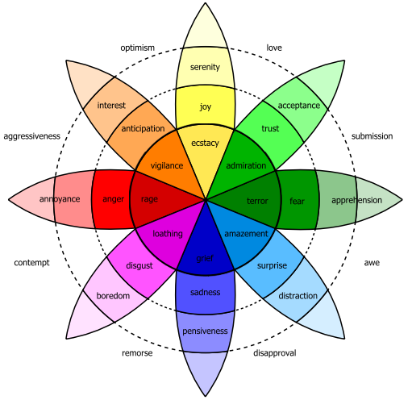

# 5. Text Classification with linear models

Text classification is the task of assigning a label or category to an entire text or document. The granularity is set by the application.
One example is **sentiment analysis**, also called opinion mining. In its simplest form it is binary (_positiv_/_negative_).

Lexial features (presence of words like _amazing_, _bad_, etc.) can be a good indicator, but they are not enough.

Other examples are **SPAM detection**, which is binary, **assign to a text its language**, which is a non-binary task, or also **autorhsip attribution**.

The approach to calssification tasks can be **rule-based** (blacklist/whitelist, regex, ...), which can lead to very accurate results if carefully refined by experts, but can be expensive to build and mintain, or with **supervised machine learning**.

## Multinomial Naive Bayes Classifiers
It's a probabilistic classifier. GIven _d_, it return the class _c'_ with max posterior probability:

_c' = argmaxc &in; C P(c|d) = argmaxc &in; C P(d|c)P(c) = argmaxc &in; C P(f1,...,fn|c)P(c)_

Where _f1,...,fn_ are the representation of the document _d_ as a set of features.

If, to simplify, we assume mutual feature independence given the class, we obtain

Which can be converted in logspace for improve efficience:

where

If _wi_ does not appear in any document of class _c_, we can use **Laplace smoothing**.

Another possible improvement is to remove _stopwords_ (words that appear so often that they are not informative), but it will not necessarily improve performance.

## Sentiment Classification

**Sentiment analysis** is the detection of _attitudes_. Each attidtude have an **holder (source)**, a **target (aspect)** and a **type**, which can be a set of types (_like_, _love_, _hate_, ...) or, more commonly, simple wighted polarity: _positive_/_negative_/_neutral_ with a _strength_ (the weight).

### Occurence vs Frequency

Word occurrence matters more than frequency, so if a word appeares more times in the same document it wil be counted just once. On the other hand, if it appeares more time in more documents in the dataset, it will be counted once _for each document_.

### Dealing with negation

Negation is very important in sentiment analysis, since it can completely change the sentiment, while the rest of the sentence remain unchanged. A very basic but pretty effective method is to add `NOT_` to all the token between negation and punctuation: `didnt like this movie, but I ...` becomes `didnt NOT_like NOT_this NOT_movie, but I ...`.

## Lexicons for Sentiment, Affect and Connotation

When we don't have sufficient training data, we con rely on specialized **sentiment lexicons**, which are list of words that express polarity in different dimensions.

According to Scherer typology of affective states, the affective states are divided in the following dimensions:
 - **emotion**
 - **mood**
 - **intepresonal stance**
 - **attitude**
 - **personality traits**

Considering the existence or more dimensions is important for deeper linguistic analysis of text in manyn different applications.

The idea of **lexicons** is to focus on specific for words to perform the analysis, instead of using each word as a feature.

### What is emotion?
There are two main theories: emotions can be viewed as combinations of a fixed, **discrete** set of atomic units, with a strength associated. (Elkman and Plutchilk models, made respectively of 6 and 8 basic emotions)

Another possibility is to describe emotions as a **continuum** 2/3-dimensional space, where the dimensions are **valence** (pleasantness of the stimulus, often is used directly as a measure of the **sentiment**), **arousal** (intensity of the emotion provoked by stimulus) and **dominance** (degree of control exerted by stimulus).

Some lexicons anssign each word a value on all three affective dimensions, not only to valence. TO assign theese values  possible procedures are **crowdsourcing** (like with ImageNet), **semi-supervised** induction of labels or **supervised** learning

## Logistic Regression

The **components of a probabilistic ML classifier** are:
 - a **feature representation** of the input _xi(j)_;
 - a ** classification function** computing _y'_ via _p(y|x)_;
 - an **objective function** involving minimizing error;
 - an **optimization algorithm**.

## Evaluation methods

The evaluation are done against **gold labels** or **gold standard**. In binary classification tasks, possible cases are the one showned in the **contingency table**:

The accuracy, which is more "complete" than precision and recall, works well only when classes are balnced, then the most common measure is actually _F1, defined as:

Evaluation metrics are of course different when multiple classes are involved. Instead of on a contingency table we can graphically show results on a a **confusion matrix**

We obtain a precision and a recall for each label, to sum up all of them we have two possible strategies:
 - **microaverage**: collect all decisions into single contingency table;
 - **macroaverage**: performance per class then average over classes, it's more appropriate when classes are equally important, which is the most frequent situation is real problems, making macroaverage the standard choice.

### Cross-validation

Since in NLP datasets are always small, **10-fold cross-validation** is a common choice

### Statistical significance Testing

If we have that a classifier _A_ performs better than another classifier _B_, how we know if _A_ is really better than _B_ or if it has only outperformed on a particular test set? To prove that our results are robust we use the **p-value**.
